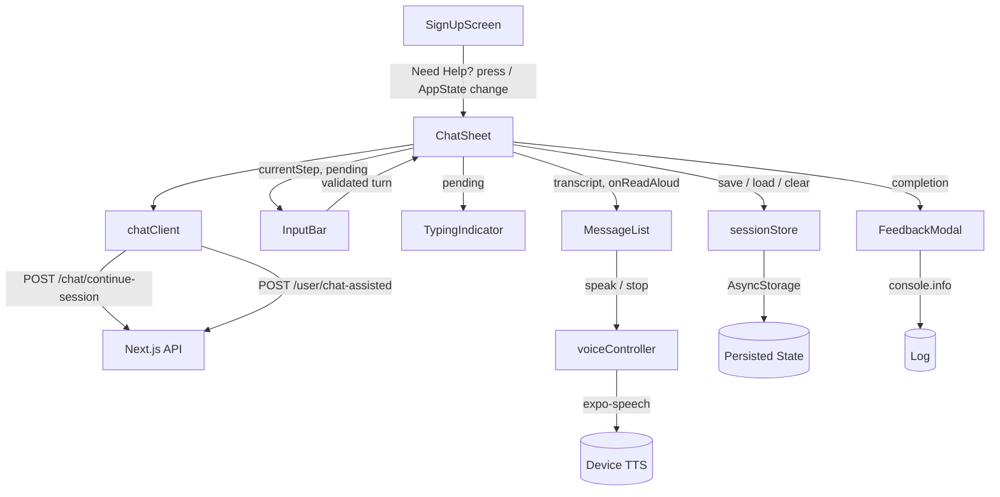

# Onboarding Chat UI V2 Design

**Spec**: `.specs/features/onboarding-chat-ui-v2/spec.md`
**Status**: Draft
**ADR**: [ADR-001](../../../docs/engineering/adr/001-mobile-client-colocated-in-api-repo.md) — Expo client colocated at `mobile/`
**TDD**: [2026-08-onboarding-chat-mobile-client](../../../docs/engineering/tdd/2026-08-onboarding-chat-mobile-client.md) (extended by this slice — the v1 TDD remains the governing architecture; this design extends it)

## Architecture Overview

Extends the v1 architecture without restructuring it. `ChatSheet` remains the single owner of
session state and the only component that calls `chatClient`. The v1 presentational children
(`MessageList`, `InputBar`) stay presentational. Four new concerns are added, each isolated in its
own module so they can be tested without rendering the sheet:

1. **`voiceController`** — a thin TTS wrapper around `expo-speech`; the only place that knows whether
   the device can synthesize speech.
2. **`TypingIndicator`** — a presentational `Animated.View` with three pulsing dots, shown when
   `pending` is true.
3. **`sessionStore`** — an `AsyncStorage` wrapper that persists the session minus the password and
   restores it on demand.
4. **`FeedbackModal`** — a `Modal` with a rating UI, shown after registration completes; records the
   rating via `console.info` (log-only, no backend route in V1).

`ChatSheet` wires all four: it renders `TypingIndicator` during `pending`, passes `voiceController`
down to `MessageList` for per-bubble read-aloud, saves/restores via `sessionStore`, and mounts
`FeedbackModal` after `completion`.



### Password exclusion (normative)

The v1 design flagged credential handling as a blocker for persistence: *"must resolve credential
handling before it can persist `collected`."* This slice resolves it by **never persisting the
password**. `sessionStore.save()` receives the full session state but strips `collected.password`
before writing to AsyncStorage. On restore, if the persisted step was `password_collection`, the
client re-enters that step with an empty password and informs the user (RESTORE-04). The password is
re-collected through the normal turn flow — it is never read back from storage.

## Code Reuse Analysis

### Existing Components to Leverage

| Component | Location | How to Use |
| --- | --- | --- |
| `ChatSheet` | `mobile/app/components/chat/ChatSheet.js` | Extended — wires `TypingIndicator` during `pending`, `voiceController` read-aloud, `sessionStore` save/restore, `FeedbackModal` after completion. The session state shape and turn flow are unchanged. |
| `MessageList` | `mobile/app/components/chat/MessageList.js` | Extended — adds a per-bubble "Read aloud" affordance on assistant bubbles, calling `voiceController.speak(text)`. Existing `announce()` live-region behavior (A11Y-03) is preserved. |
| `InputBar` | `mobile/app/components/chat/InputBar.js` | Unchanged — the `pending` prop already drives the disabled state; `TypingIndicator` renders alongside in `ChatSheet`, not here. |
| `accessibility.js` | `mobile/app/lib/accessibility.js` | Reused — `useScreenReaderEnabled()` drives VOICE-04 (show read-aloud affordance when screen reader active); `announce()` continues to announce new replies. |
| `session.js` | `mobile/app/lib/session.js` | Reused — `createChatSessionId()` still mints ids; `sessionStore` persists the id, not the minting logic. |
| `stepRules.js` | `mobile/app/lib/stepRules.js` | Reused — `INITIAL_CHAT_STEP`, `FINAL_CHAT_STEP`, `fieldForStep` unchanged; `sessionStore` stores `currentStep` as-is. |
| `Styles.js` | `mobile/app/components/Styles.js` | Extended — `useThemeStyles()` gains keys for the typing dots, read-aloud button, and feedback modal; the colorScheme-aware `StyleSheet.create` pattern is followed. |

### Integration Points

| System | Integration Method |
| --- | --- |
| `expo-speech` | `Speech.speak(text, options)` / `Speech.stop()` / `Speech.isSpeakingAsync()` / `Speech.getAvailableVoicesAsync()`; `isSupported` derived from `Speech.getAvailableVoicesAsync()` resolving non-empty |
| `@react-native-async-storage/async-storage` | `AsyncStorage.setItem(key, JSON.stringify(state))` / `AsyncStorage.getItem(key)` / `AsyncStorage.removeItem(key)`; a single key (`@onboarding_chat_session`) holds the persisted blob |
| `AccessibilityInfo` | Already used in v1 (`mobile/app/lib/accessibility.js`); `useScreenReaderEnabled()` gates the read-aloud affordance (VOICE-04) and `accessibilityLiveRegion` on `TypingIndicator` (LOAD-02) |
| React Native `Animated` | `Animated.loop(Animated.sequence([...]))` for pulsing dots; no new dep |
| `AppState` | `AppState.addEventListener('change', …)` to detect backgrounding; triggers `sessionStore.save()` (debounced) |
| `console.info` | Log-only feedback recording (FEEDBACK-02); no logger exists in `mobile/` — `getAppLogger` is API-side and the app is fenced |

## Components

### `voiceController` (new)

**Purpose**: The only module that knows whether the device can synthesize speech and how to drive
`expo-speech`. Isolating it keeps TTS mockable in tests without rendering any component.

**Location**: `mobile/app/lib/voiceController.js` (new)

**Behavior**:

1. `isSupported()` returns a promise resolving to `true` if `Speech.getAvailableVoicesAsync()`
   resolves with a non-empty array, `false` otherwise. Cached after first resolution.
2. `speak(text, { onDone })` calls `Speech.speak(text, { language: 'en-US', onDone })`; if already
   speaking, stops first to avoid overlap.
3. `stop()` calls `Speech.stop()`; safe to call when not playing.
4. `isSpeaking()` returns the `Speech.isSpeakingAsync()` promise.

**Interfaces**:

```
voiceController.isSupported() -> Promise<boolean>
voiceController.speak(text, options?) -> void
voiceController.stop() -> void
voiceController.isSpeaking() -> Promise<boolean>
```

**Dependencies**: `expo-speech` (new dep — must be added to `mobile/package.json`).

**Reuses**: nothing from v1; `accessibility.js`'s `announce()` is a separate screen-reader channel.

### `TypingIndicator` (new)

**Purpose**: Animated three-pulsing-dots indicator shown while a turn is in flight, replacing v1's
plain `pending` text.

**Location**: `mobile/app/components/chat/TypingIndicator.js` (new)

**Behavior**:

1. Three `Animated.View` dots; each fades/scales in a staggered loop via `Animated.loop` +
   `Animated.sequence`.
2. The container exposes `accessibilityLiveRegion="polite"` and an `accessibilityLabel` of
   "STEDI is typing" (LOAD-02).
3. Starts on mount, stops on unmount (cleanup in `useEffect`).

**Interfaces**: `<TypingIndicator />` (no props).

**Dependencies**: React Native `Animated` (already available).

**Reuses**: `MAX_FONT_SCALE` and `useThemeStyles()` from `mobile/app/components/Styles.js` for
colorScheme-aware dot styling.

### `sessionStore` (new)

**Purpose**: Persists the chat session to AsyncStorage on backgrounding and restores it on reopen,
excluding the password.

**Location**: `mobile/app/lib/sessionStore.js` (new)

**Behavior**:

1. `save(state)` strips `collected.password` from `state`, then `AsyncStorage.setItem(SESSION_KEY,
   JSON.stringify(sanitized))`. Never writes the password.
2. `load()` reads the blob; returns `null` if absent, empty, or unparseable (graceful corruption
   handling). Returns `{ ...state, savedAt }`.
3. `clear()` calls `AsyncStorage.removeItem(SESSION_KEY)`.
4. `isExpired(savedAt, ttlMs)` returns `true` if `Date.now() - savedAt > ttlMs`; default TTL = 30 min
   (`30 * 60 * 1000`), mirroring `CHAT_SESSION_TIMEOUT_MS`.

**Interfaces**:

```
sessionStore.save(state: ChatSessionState) -> Promise<void>
sessionStore.load() -> Promise<ChatSessionState | null>
sessionStore.clear() -> Promise<void>
sessionStore.isExpired(savedAt: number, ttlMs?: number) -> boolean
```

**Dependencies**: `@react-native-async-storage/async-storage` (new dep — must be added to
`mobile/package.json`).

**Reuses**: `INITIAL_CHAT_STEP` from `stepRules.js` as the default restored step when load returns
`null` (caller responsibility, not the store).

### `FeedbackModal` (new)

**Purpose**: A modal shown after registration completes, asking "Was this onboarding helpful?" with
a rating mechanism. Records the rating log-only via `console.info` (FEEDBACK-02) — no backend route.

**Location**: `mobile/app/components/chat/FeedbackModal.js` (new)

**Behavior**:

1. Renders a `Modal` with a rating UI (thumbs up/down, accessible via `accessibilityRole`).
2. On submit, calls `onSubmit(rating)` — the parent (`ChatSheet`) logs via `console.info` and
   dismisses.
3. On dismiss without submit, calls `onDismiss` — no feedback recorded (FEEDBACK-03).
4. The modal does not block the success state: dismissal or submit both close it and let the user
   proceed to sign in (FEEDBACK-04).

**Interfaces**: `<FeedbackModal visible onSubmit={rating => …} onDismiss />`

**Dependencies**: React Native `Modal`, `TouchableOpacity`, `Text`.

**Reuses**: `MAX_FONT_SCALE` and `useThemeStyles()` from `mobile/app/components/Styles.js`.

### `ChatSheet` (modified)

**Purpose**: Remains the session owner. Wires the four new concerns into the existing turn flow
without restructuring it.

**Location**: `mobile/app/components/chat/ChatSheet.js` (modify)

**Behavior**:

1. During `pending`, renders `<TypingIndicator />` in place of the plain pending text (LOAD-01/03).
2. After each successful turn, calls `sessionStore.save(state)` (debounced) so a backgrounding
   mid-flow persists (RESTORE-01).
3. On mount, if `chatSessionId` is null but a persisted session exists and is not expired, restores
   it (RESTORE-02); if expired, clears it (RESTORE-03).
4. On restore, if the persisted step was `password_collection`, sets `collected.password` to empty
   and shows an inline notice (RESTORE-04).
5. After successful registration (`onRegistered`), calls `sessionStore.clear()` (RESTORE-05) and
   mounts `<FeedbackModal />` (FEEDBACK-01).
6. Passes `voiceController` and `onReadAloud` down to `MessageList` for per-bubble read-aloud
   (VOICE-01/02). On unmount/dismiss, calls `voiceController.stop()` to halt TTS (edge case).

**Interfaces**: unchanged (`<ChatSheet visible chatSessionId onDismiss onRegistered onRestart accessibilityMode />`),
with internal wiring of new modules.

**Dependencies**: `voiceController`, `TypingIndicator`, `sessionStore`, `FeedbackModal` (all new);
existing `chatClient`, `stepRules`, `MessageList`, `InputBar`.

**Reuses**: v1 `ChatSheet` session state shape and turn flow; `AppState` listener for backgrounding.

### `MessageList` (modified)

**Purpose**: Adds a per-bubble "Read aloud" affordance on assistant bubbles.

**Location**: `mobile/app/components/chat/MessageList.js` (modify)

**Behavior**:

1. On each assistant bubble, renders a "Read aloud" `TouchableOpacity` when `voiceController.isSupported()`
   is true (VOICE-01) and the bubble is an assistant turn.
2. Activating it calls `voiceController.speak(text)`; while speaking, the affordance swaps to a
   "Stop" control (VOICE-02).
3. The affordance is always visible when supported; when a screen reader is active, it is announced
   alongside the bubble (VOICE-04 builds on A11Y-03).
4. Masked bubbles (credential turns) do NOT get a read-aloud affordance — never speak the password.

**Interfaces**: `<MessageList entries maskedIndexes onReadAloud={index => …} voiceSupported />`

**Dependencies**: `voiceController` (passed in or imported).

**Reuses**: v1 `MessageList` rendering, scroll, and `announce()` behavior.

## Data Models

No database changes. The in-memory `ChatSessionState` from v1 is extended with one optional field:

```
ChatSessionState {
  chatSessionId: string          // client-minted UUID, <= 128 chars
  currentStep: string            // one of CHAT_STEPS
  transcript: { role, message }[]
  collected: {
    name?, email?, phone?, birthDate?, password?
  }
  pending: boolean
  error: string | null
  lastActivity: string | null    // ISO, from the last successful continue-session
  credentialTurnIndex: number | null
  retryField: string | null       // v1
  expired: boolean                // v1
  feedback?: { rating: number, comment?: string }   // v2 — set after FeedbackModal submit
}
```

**Persistence shape** (what `sessionStore.save()` writes — a strict subset):

```
PersistedSessionState {
  chatSessionId: string
  currentStep: string
  transcript: { role, message }[]
  collected: { name?, email?, phone?, birthDate? }   // password EXCLUDED
  credentialTurnIndex: number | null
  lastActivity: string | null
  savedAt: number                                     // Date.now() at save time
}
```

`collected.password` is **never** in the persisted blob. On restore, if `currentStep` is
`password_collection`, the caller sets `collected.password = undefined` and informs the user
(RESTORE-04).

## Error Handling Strategy

| Error Scenario | Handling | User Impact |
| --- | --- | --- |
| TTS unsupported on device | `voiceController.isSupported()` returns `false`; read-aloud affordance hidden (VOICE-03) | No read-aloud control shown; screen reader announcements (A11Y-03) still work |
| TTS playback fails mid-utterance | `Speech.speak` `onError` / `onStopped` callback; `voiceController` resets internal state | Silent; user can re-tap read-aloud |
| AsyncStorage setItem fails (full) | `sessionStore.save()` catches, logs warning via `console.warn`, returns `null`; session continues in-memory | No restore available on next open; fresh session starts — no crash |
| AsyncStorage getItem returns corrupt JSON | `sessionStore.load()` catches parse error, returns `null` | Fresh session starts (RESTORE-03 fallback) |
| Restored session 408 on resume | `chatClient` returns `{ ok: false, kind: 'expired' }`; `ChatSheet` clears persisted state and starts fresh (RESTORE-03) | User sees expired state / fresh start |
| Feedback `console.info` throws | Caught silently; does not block the success state or modal close (FEEDBACK-04) | Feedback not recorded, but user proceeds to sign in |
| Rapid minimize/restore cycles | Persistence debounced (short timeout); trailing save wins | One AsyncStorage write per debounce window, no thrash |

## Risks & Concerns

| Concern | Location | Impact | Mitigation |
| --- | --- | --- | --- |
| Password persisted to AsyncStorage | `sessionStore.save()` | Critical — credential at rest on device | `save()` strips `collected.password` before serializing; unit test asserts the persisted blob has no `password` key; RESTORE-04 re-collects on resume |
| AsyncStorage corruption on OS update | `sessionStore.load()` | Medium — restore fails | `load()` catches parse errors, returns `null`, fresh session starts (never crashes) |
| TTS differences between iOS and Android | `voiceController` | Medium — voice availability/rate differ | `isSupported()` gates the affordance per device; defaults used; tested via mocked `expo-speech` |
| STT feasibility on SDK 54 | `expo-speech-recognition` | Medium — STT input deferred | V1 ships TTS only; STT documented in Out of Scope; P2 if a viable package is confirmed during execution |
| New deps break the mobile gate | `mobile/package.json` | Medium — `expo-speech` / `async-storage` must install and mock cleanly in jest-expo | Mock both in `jest.config.js` / `__mocks__`; gate runs after each task |
| Typing indicator animation jank on low-end Android | `TypingIndicator` | Low — cosmetic | `Animated` with `useNativeDriver` where possible; dots are lightweight |

## Tech Decisions

| Decision | Choice | Rationale |
| --- | --- | --- |
| TTS engine | `expo-speech` | On-device, no cloud dep, available on iOS + Android via Expo SDK 54; covers the visually-impaired read-aloud need |
| Persistence layer | `@react-native-async-storage/async-storage`, excluding password | Standard RN persistence; v1 flagged credential handling as the blocker — resolved by never persisting the password |
| Feedback recording | Log-only via `console.info` (no logger in `mobile/`) | No backend route added (preserves v1 read-only constraint); feedback collected but not server-persisted in V1 |
| Typing indicator | React Native `Animated` (no new dep) | Already available; three pulsing dots replace plain `pending` text |
| STT input | Deferred (P2) | No viable built-in on SDK 54 without a heavy/uncertain dep; TTS covers the read-aloud need; STT is an enhancement |
| SCRUM-99 | Superseded — tests ship inside T7-T10 | Matches `CONVENTIONS.md` and v1 precedent; avoids a standalone test task |
| Session restore trigger | `AppState` `'background'` change + debounced save | Detects minimization; debounce avoids thrash on rapid cycles |
| Restore TTL | 30 min (matches `CHAT_SESSION_TIMEOUT_MS`) | Server-side session expires at 30 min; restoring a server-dead session yields 408 → fresh start |

> **Project-level decisions**: ADR-001 (app placement, Expo/RNTL baseline, API base-URL convention)
> remains governing. This slice adds no new ADR — the tech decisions above are slice-scoped.