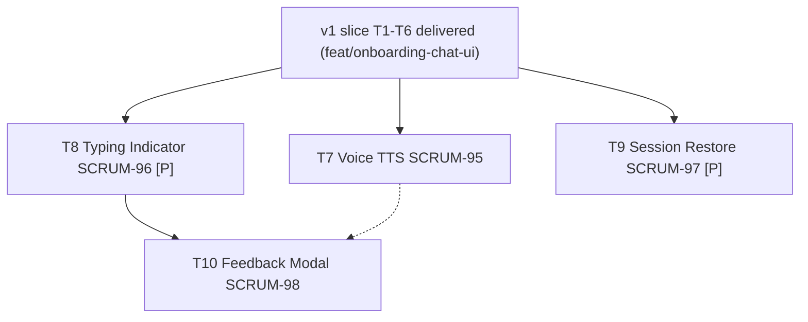

# Onboarding Chat UI V2 Tasks

**Spec**: `.specs/features/onboarding-chat-ui-v2/spec.md`
**Design**: `.specs/features/onboarding-chat-ui-v2/design.md`
**Epic / Slice**: [SCRUM-140](https://csai420.atlassian.net/browse/SCRUM-140) — task issues SCRUM-95..99 exist and are enriched from this file; T7-T10 cover SCRUM-95..98; SCRUM-99 is superseded.
**Branch (planned)**: `feat/onboarding-chat-ui-v2` — single slice branch; one atomic commit per task. Forks from `feat/onboarding-chat-ui` (v1 branch, not yet merged to main).
**Execution**: Runs in a separate session via `/sdd-execute-jira` — never inline with this planning session.

## Execution Protocol (MANDATORY -- do not skip)

Activate `tlc-spec-driven` by name and follow its Execute flow and Critical Rules. Do not search for
skill files by filesystem path. **If the skill cannot be activated, STOP and tell the user — do not
proceed without it.**

**Repo override (NON-NEGOTIABLE):** planning and execution are two separate sessions. This file is a
planning artifact; no source code is written in the session that produced it.

**UI skills (NON-NEGOTIABLE for T7-T10):** before writing component code, load
`.agents/skills/react-best-practices/SKILL.md` then `.agents/skills/web-design-guidelines/SKILL.md`,
in that order, per `.opencode/rules/react-ui-on-demand.md`. The shadcn MCP does **not** apply — it
emits web components, and this is React Native.

**Backend is read-only.** No task in this slice modifies anything under `src/`, `prisma/`, or
`__test__/`. Feedback is log-only (FEEDBACK-02) — no backend route is added, preserving the v1
read-only constraint. The only non-`mobile/` edits are additive dependency additions in
`mobile/package.json` (new deps: `expo-speech`, `@react-native-async-storage/async-storage`).

## Test Coverage Matrix

| Code Layer | Required Test Type | Coverage Expectation | Location Pattern | Run Command |
| --- | --- | --- | --- | --- |
| TTS wrapper (`mobile/app/lib/voiceController.js`) | unit | `isSupported`, `speak`, `stop`, `isSpeaking`; mocked `expo-speech` | `mobile/__tests__/voiceController.test.js` | `cd mobile && npx jest` |
| Persistence (`mobile/app/lib/sessionStore.js`) | unit | save strips password; load handles absent/corrupt; clear; isExpired | `mobile/__tests__/sessionStore.test.js` | `cd mobile && npx jest` |
| Components (`mobile/app/components/`) | component (RNTL) | Render, interaction, accessibility queries | `mobile/__tests__/<Component>.test.js` | `cd mobile && npx jest` |
| Modified components (`ChatSheet`, `MessageList`) | component (RNTL) | New wiring; no v1 regressions | `mobile/__tests__/ChatSheet.test.js`, `MessageList.test.js` | `cd mobile && npx jest` |
| Root toolchain fences | regression | Root pipeline unchanged | existing suites | `npm run format && npm run lint && npm run typecheck && npm run test:unit` |

Tests are part of the task that changes behavior — never a separate task. This is why SCRUM-99
("Write Jest component tests") is absorbed rather than scheduled.

## Parallelism Assessment

| Test Type | Parallel-Safe? | Isolation Model | Evidence |
| --- | --- | --- | --- |
| Mobile unit | yes | Jest per-file module registry; `expo-speech` / `AsyncStorage` stubbed per test | No shared server, no DB |
| Mobile component | yes | RNTL renders into an isolated tree per test | No global state; `ChatSheet` state is component-local |
| Root regression | yes | Unchanged from today | Existing CI runs them in parallel jobs |

## Gate Check Commands

| Gate Level | Command |
| --- | --- |
| Mobile | `cd mobile && npx jest` |
| Root regression | `npm run format && npm run lint && npm run typecheck && npm run test:unit` |
| Full | Mobile + Root regression + `npm run build` |

## Execution Plan

### Phase 1: Voice (Sequential)

- T7 — `voiceController` (TTS) + `MessageList` read-aloud affordance + `ChatSheet` wiring. Depends on
  v1 (already delivered). Establishes the `voiceController` module that T8-T10 do not depend on.

### Phase 2: Typing + Restore (Parallel)

- T8 [P] — `TypingIndicator` replaces plain `pending` text in `ChatSheet`. Touches `ChatSheet` render
  branch for pending.
- T9 [P] — `sessionStore` (AsyncStorage) + `ChatSheet` save/restore + `SignUpScreen` restore-on-mount.
  Touches `ChatSheet` lifecycle and `SignUpScreen`, not the pending render branch.
- Both extend `ChatSheet` but touch different concerns (render-branch vs lifecycle); parallel-safe
  with rebase-on-integrate.

### Phase 3: Feedback (Sequential)

- T10 — `FeedbackModal` mounted after `completion`. Depends on T8 (shown after the typing indicator
  resolves into the success/feedback state).

### (T11 = SCRUM-99 — Superseded — no task body; see note below)

## Task Breakdown

### T7: Voice I/O (TTS) for assistant replies — SCRUM-95

**What**: Add on-device TTS playback for assistant replies via `expo-speech`. Build a `voiceController`
wrapper, add a per-bubble "Read aloud" affordance to `MessageList`, and wire it in `ChatSheet`.

**Where**:
- `mobile/app/lib/voiceController.js` (new)
- `mobile/app/components/chat/MessageList.js` (modify — read-aloud affordance on assistant bubbles)
- `mobile/app/components/chat/ChatSheet.js` (modify — wire `voiceController`, stop on unmount)
- `mobile/app/components/Styles.js` (modify — read-aloud button styles)
- `mobile/package.json` (modify — add `expo-speech`)
- `mobile/__tests__/voiceController.test.js` (new)
- `mobile/__tests__/MessageList.test.js` (modify — read-aloud tests)

**Depends on**: v1 slice delivered (`feat/onboarding-chat-ui` — `ChatSheet`, `MessageList`, `accessibility.js` exist).

**Reuses**: `expo-speech` (new dep); `AccessibilityInfo` / `useScreenReaderEnabled()` from v1
(`mobile/app/lib/accessibility.js`) for VOICE-04; `MAX_FONT_SCALE` / `useThemeStyles()` from
`mobile/app/components/Styles.js`.

**Requirement**: VOICE-01 → VOICE-04

**Branch**: `feat/onboarding-chat-ui-v2`

**Tools**:
- MCP: context7 (`expo-speech` API for SDK 54 — `Speech.speak` / `stop` / `getAvailableVoicesAsync`)
- Skill: `react-best-practices`, then `web-design-guidelines`

**Done when**:
- [ ] `voiceController.isSupported()` resolves `true`/`false` based on available voices; cached (VOICE-03)
- [ ] `voiceController.speak(text)` synthesizes speech; `stop()` halts it; no overlap on re-speak (VOICE-01)
- [ ] `MessageList` renders a "Read aloud" affordance on assistant bubbles when supported (VOICE-01)
- [ ] While speaking, the affordance swaps to a "Stop" control (VOICE-02)
- [ ] When TTS is unsupported, the affordance is NOT presented (VOICE-03)
- [ ] When a screen reader is active, the affordance is announced alongside the bubble (VOICE-04, builds on A11Y-03)
- [ ] Masked (credential) bubbles do NOT get a read-aloud affordance — password never spoken
- [ ] `ChatSheet` calls `voiceController.stop()` on unmount/dismiss (edge case: TTS interrupted by navigation)
- [ ] `expo-speech` added to `mobile/package.json` and mocked in jest-expo
- [ ] Gate passes: Mobile (test count: ≥ 6 new, no v1 regressions)

**Tests**: unit + component
**Gate**: mobile
**Commit**: `feat(onboarding-chat-ui-v2): add TTS for assistant replies`

---

### T8: Animated typing indicator — SCRUM-96 [P]

**What**: Replace the plain `pending` text in `ChatSheet` with an animated three-pulsing-dots
`TypingIndicator` component, announced as "STEDI is typing" to screen readers.

**Where**:
- `mobile/app/components/chat/TypingIndicator.js` (new)
- `mobile/app/components/chat/ChatSheet.js` (modify — render `TypingIndicator` during `pending` instead of plain text)
- `mobile/app/components/Styles.js` (modify — typing-dot styles)
- `mobile/__tests__/TypingIndicator.test.js` (new)
- `mobile/__tests__/ChatSheet.test.js` (modify — typing indicator shown during pending)

**Depends on**: v1 slice delivered. *(parallel-safe with T9 — touches the `pending` render branch of
`ChatSheet`, not the lifecycle hooks T9 adds)*

**Reuses**: React Native `Animated` (already available, no new dep); `MAX_FONT_SCALE` /
`useThemeStyles()` from `mobile/app/components/Styles.js`; `accessibilityLiveRegion` pattern from v1
`MessageList`.

**Requirement**: LOAD-01 → LOAD-03

**Branch**: `feat/onboarding-chat-ui-v2`

**Tools**:
- MCP: context7 (React Native `Animated.loop` / `Animated.sequence` API)
- Skill: `react-best-practices`, then `web-design-guidelines`

**Done when**:
- [ ] `TypingIndicator` renders three dots with staggered pulsing animation (LOAD-01)
- [ ] Animation starts on mount, stops on unmount (no leak)
- [ ] Container has `accessibilityLiveRegion="polite"` and `accessibilityLabel="STEDI is typing"` (LOAD-02)
- [ ] `ChatSheet` renders `<TypingIndicator />` when `pending` is true, replacing plain text (LOAD-01)
- [ ] When the request completes (success or failure), the indicator is removed and replaced with the result (LOAD-03)
- [ ] No v1 regressions in `ChatSheet.test.js`
- [ ] Gate passes: Mobile (test count: ≥ 3 new, no v1 regressions)

**Tests**: component
**Gate**: mobile
**Commit**: `feat(onboarding-chat-ui-v2): add animated typing indicator`

---

### T9: Session restore via AsyncStorage — SCRUM-97 [P]

**What**: Persist the chat session to AsyncStorage on backgrounding (excluding the password) and
restore it on reopen if within the 30-minute TTL. Wire `ChatSheet` save/restore and `SignUpScreen`
restore-on-mount.

**Where**:
- `mobile/app/lib/sessionStore.js` (new)
- `mobile/app/components/chat/ChatSheet.js` (modify — save on `AppState` background, restore on mount, clear on completion)
- `mobile/app/screens/SignUpScreen.js` (modify — restore on mount; offer resume)
- `mobile/app/components/Styles.js` (modify — restore-notice styles)
- `mobile/package.json` (modify — add `@react-native-async-storage/async-storage`)
- `mobile/__tests__/sessionStore.test.js` (new)
- `mobile/__tests__/ChatSheet.test.js` (modify — save/restore/clear tests)

**Depends on**: v1 slice delivered. *(parallel-safe with T8 — touches `ChatSheet` lifecycle hooks and
`SignUpScreen`, not the `pending` render branch T8 changes)*

**Reuses**: `@react-native-async-storage/async-storage` (new dep); `AppState` from React Native;
`INITIAL_CHAT_STEP` / `FINAL_CHAT_STEP` from `mobile/app/lib/stepRules.js`; `createChatSessionId()`
from `mobile/app/lib/session.js`.

**Requirement**: RESTORE-01 → RESTORE-05

**Branch**: `feat/onboarding-chat-ui-v2`

**Tools**:
- MCP: context7 (`@react-native-async-storage/async-storage` API; React Native `AppState`)
- Skill: `react-best-practices`, then `web-design-guidelines`

**Done when**:
- [ ] `sessionStore.save(state)` strips `collected.password` before writing to AsyncStorage (RESTORE-01) — unit test asserts the persisted blob has no `password` key
- [ ] `sessionStore.load()` returns `null` for absent/corrupt data (graceful — never throws) (edge case)
- [ ] `sessionStore.clear()` removes the key (RESTORE-05)
- [ ] `sessionStore.isExpired(savedAt, ttlMs)` returns `true` after 30 min (RESTORE-03)
- [ ] `ChatSheet` saves to `sessionStore` on `AppState` `'background'` (debounced) (RESTORE-01)
- [ ] On reopen, if a non-expired persisted session exists, `ChatSheet` resumes at the persisted step with the persisted transcript (RESTORE-02)
- [ ] If the persisted session is expired, the client discards it and starts fresh (RESTORE-03)
- [ ] On restore, if the persisted step was `password_collection`, the password field is empty and the user is informed (RESTORE-04)
- [ ] After successful registration, `sessionStore.clear()` is called (RESTORE-05)
- [ ] `@react-native-async-storage/async-storage` added to `mobile/package.json` and mocked in jest-expo
- [ ] Gate passes: Mobile (test count: ≥ 7 new, no v1 regressions)

**Tests**: unit + component
**Gate**: mobile
**Commit**: `feat(onboarding-chat-ui-v2): add session restore excluding password`

---

### T10: Post-chat feedback modal — SCRUM-98

**What**: Add a `FeedbackModal` shown after registration completes, asking "Was this onboarding
helpful?" with a rating mechanism. Record the rating log-only via `console.info` (no backend route).

**Where**:
- `mobile/app/components/chat/FeedbackModal.js` (new)
- `mobile/app/components/chat/ChatSheet.js` (modify — mount `FeedbackModal` after completion)
- `mobile/app/components/Styles.js` (modify — feedback modal styles)
- `mobile/__tests__/FeedbackModal.test.js` (new)
- `mobile/__tests__/ChatSheet.test.js` (modify — feedback shown after completion)

**Depends on**: T8 (feedback appears after the typing indicator resolves into the success/feedback state)

**Reuses**: `MAX_FONT_SCALE` / `useThemeStyles()` from `mobile/app/components/Styles.js`; React
Native `Modal` / `TouchableOpacity` (v1 `ChatSheet` `Modal` idiom).

**Requirement**: FEEDBACK-01 → FEEDBACK-04

**Branch**: `feat/onboarding-chat-ui-v2`

**Tools**:
- MCP: context7 (React Native `Modal` API — already used in v1 `ChatSheet`)
- Skill: `react-best-practices`, then `web-design-guidelines`

**Done when**:
- [ ] `FeedbackModal` renders "Was this onboarding helpful?" with a rating mechanism (thumbs up/down) (FEEDBACK-01)
- [ ] On submit, the rating is recorded via `console.info` (log-only, no backend route) (FEEDBACK-02)
- [ ] On dismiss without submit, no feedback is recorded and the success state is not blocked (FEEDBACK-03)
- [ ] On submit or dismiss, the modal closes and the user can proceed to sign in (FEEDBACK-04)
- [ ] `ChatSheet` mounts `FeedbackModal` after registration completes (`onRegistered` → success → feedback)
- [ ] Every interactive element in the modal has a non-empty `accessibilityLabel` and `accessibilityRole` (A11Y-01 carries forward)
- [ ] Gate passes: Mobile (test count: ≥ 4 new, no v1 regressions)

**Tests**: component
**Gate**: mobile
**Commit**: `feat(onboarding-chat-ui-v2): add post-chat feedback modal`

---

### T11: SCRUM-99 — Superseded

SCRUM-99 ("Write Jest component tests for React Native chat UI rendering and user interactions") is
**superseded**. Per `.specs/codebase/CONVENTIONS.md` ("Tests are part of the task that changes
behavior — not separate tasks") and the v1 precedent (tests shipped inside T1-T6, never as a
standalone task), SCRUM-99 has no task body in this slice. Tests ship inside T7-T10 — each task's
"Tests" and "Done when" sections specify its co-located tests.

**Recommendation:** close SCRUM-99 as superseded once this slice lands.

---

## Parallel Execution Map

## Task Granularity Check

| Task | Scope | Status |
| --- | --- | --- |
| T7 | One new lib module + one component modification + one sheet wiring | ✅ |
| T8 | One new presentational component + one sheet render-branch change | ✅ |
| T9 | One new lib module + one sheet lifecycle change + one screen change | ✅ |
| T10 | One new component + one sheet mount change | ✅ |
| T11 | Superseded — no task body | ✅ |

## Diagram-Definition Cross-Check

| Task | Depends On (task body) | Diagram Shows | Status |
| --- | --- | --- | --- |
| T7 | v1 (delivered) | v1 → T7 | ✅ |
| T8 | v1 (delivered) | v1 → T8 | ✅ |
| T9 | v1 (delivered) | v1 → T9 | ✅ |
| T10 | T8 | T8 → T10 (T7 dashed — soft dep, T10 needs T7's voice stop on unmount if mounted together) | ✅ |
| T11 | (superseded) | (none) | ✅ |

## Test Co-location Validation

| Task | Code Layer Created/Modified | Matrix Requires | Task Says | Status |
| --- | --- | --- | --- | --- |
| T7 | `mobile/app/lib/`, `mobile/app/components/` | unit + component | unit + component, gate mobile | ✅ |
| T8 | `mobile/app/components/` | component | component | ✅ |
| T9 | `mobile/app/lib/`, `mobile/app/components/`, `mobile/app/screens/` | unit + component | unit + component | ✅ |
| T10 | `mobile/app/components/` | component | component | ✅ |
| T11 | (superseded — tests ship in T7-T10) | — | — | ✅ |