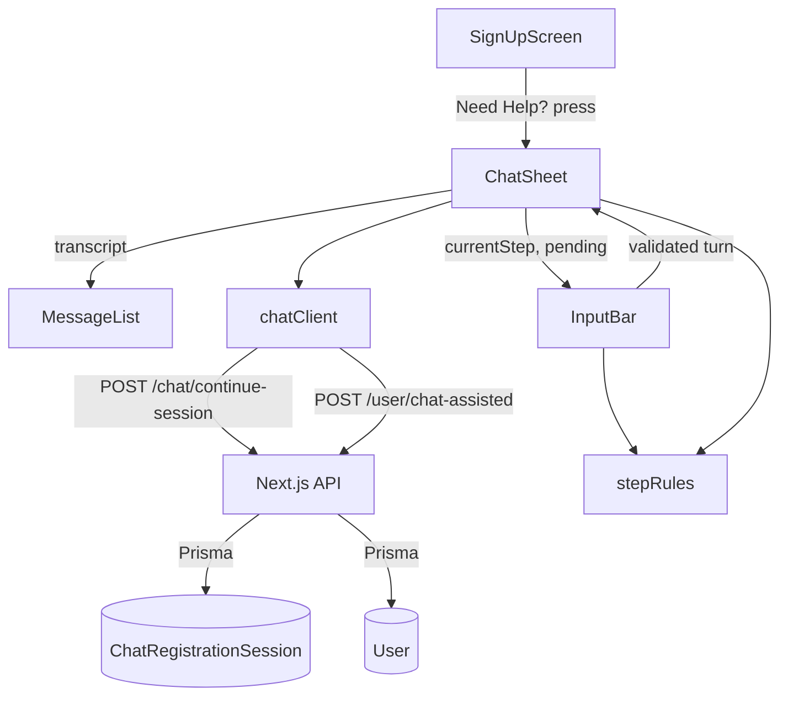

# Onboarding Chat UI Design

**Spec**: `.specs/features/onboarding-chat-ui/spec.md`
**Status**: Draft
**ADR**: [ADR-001](../../../docs/engineering/adr/001-mobile-client-colocated-in-api-repo.md) — Expo client colocated at `mobile/`
**TDD**: [2026-08-onboarding-chat-mobile-client](../../../docs/engineering/tdd/2026-08-onboarding-chat-mobile-client.md)

## Architecture Overview

A stateful container over a stateless transport. `ChatSheet` is the single owner of session state;
`chatClient` is the single place that knows URLs and status codes; `MessageList` and `InputBar` are
presentational and receive everything by prop. No global store, no context provider — the state fits
in one component and lifting it further would only add indirection.

The design is shaped by one fact about the delivered backend: `advanceChat()`
(`src/app/chat/continue-session/route.ts:38`) is a pure step counter. It returns the prompt for the
current step and advances to the next. It never reads the user's message, never extracts a field,
and never validates. Everything the server does not do, the client must.



### Step-to-field mapping (normative)

The field a message fills is determined by the step the session is in **when the message is sent** —
not by the step returned in the response. This table is the reference implementation of that rule;
`stepRules` encodes it.

| Step when sending       | Fills            | Server replies with                            | Next step               |
| ----------------------- | ---------------- | ---------------------------------------------- | ----------------------- |
| `initial_greeting`      | *(opener)*       | "I'd be happy to help! What's your name?"      | `name_provided`         |
| `name_provided`         | `name`           | "Great! What's your email address?"            | `email_collection`      |
| `email_collection`      | `email`          | "Thanks! What is your phone number?"           | `phone_collection`      |
| `phone_collection`      | `phone`          | "Perfect. What's your date of birth?"          | `birth_date_collection` |
| `birth_date_collection` | `birthDate`      | "Almost done! Please choose a password."       | `password_collection`   |
| `password_collection`   | `password`       | "Ready to finish? Let me create your account." | `completion`            |
| `completion`            | —                | "Your registration is complete!"               | `completion`            |

`message` is required (`min(1)`), so the first prompt cannot be obtained without sending something.
Opening the sheet sends a synthetic opener; it fills no field and appears in the transcript as an
ordinary user turn.

## Code Reuse Analysis

### Existing Components to Leverage

| Component | Location | How to Use |
| --- | --- | --- |
| `CHAT_STEPS` order and `ASSISTANT_PROMPTS` text | `src/app/chat/continue-session/route.ts:14-36` | Source of truth for the step sequence and the exact prompt strings asserted in tests |
| `ChatAssistedRegistrationSchema` | `src/lib/schemas/chat-assisted-registration.schema.ts` | Rule-for-rule source for the client-side validators in `stepRules` — email, password complexity, `birthDate` calendar check, phone regex, name character rules |
| `splitName()` fallback behavior | `src/app/api/user/register-chat/route.ts:10-18` | Precedent for defaulting a missing name part to `'User'` rather than rejecting a one-word name |
| `CHAT_SESSION_TIMEOUT_MS` semantics | `src/app/user/chat-assisted/route.ts:23` | 30-minute window; informs what `lastActivity` the client sends |
| `useThemeStyles()` hook pattern | `cs420-rn1-code-challenge-asf0/app/components/Styles.js` | Copy the idiom (colorScheme-aware `StyleSheet.create` returned from a hook, composed as `style={[styles.x, {…}]}`); the chat needs new keys, not the same ones |
| Exported, JSDoc'd async API functions unit-tested directly | `cs420-rn2-code-challenge-asf0/app/screens/NotificationScreen.js` | Idiom for `chatClient`: named async exports, `global.fetch = jest.fn()` in tests |
| `expo-constants` for config | `cs420-rn2-code-challenge-asf0` (EAS projectId) | Extend to `extra.apiBaseUrl` rather than hardcoding a base URL as rn1/rn2 do |

### Integration Points

| System | Integration Method |
| --- | --- |
| `POST /chat/continue-session` | `fetch`, JSON, no auth header, no `/api` prefix |
| `POST /user/chat-assisted` | `fetch`, JSON, no auth header, no `/api` prefix |
| Expo config | `Constants.expoConfig.extra.apiBaseUrl` |
| Device accessibility | `AccessibilityInfo` (screen-reader detection, announcements), OS font scale via `useWindowDimensions().fontScale` |

## Components

### `chatClient`

**Purpose**: The only module that knows endpoint paths, request shapes, and HTTP status meanings.

**Location**: `mobile/app/api/chatClient.js` (new)

**Behavior**:

1. Resolves the base URL from `Constants.expoConfig.extra.apiBaseUrl`; throws an explicit
   configuration error when absent, so a misconfigured build fails loudly instead of requesting
   `undefined/chat/continue-session`.
2. `continueSession` posts and returns the parsed body on **200**; maps **400** to a typed
   validation outcome carrying `errors[]`; maps everything else to a typed failure.
3. `registerChatAssisted` posts and returns a discriminated outcome per status — **201** created,
   **400** invalid with `errors[]`, **408** expired, **409** duplicate email, otherwise failed. It
   does not throw for expected statuses; collapsing them would lose the branches INPUT-12/13/14 need.

**Interfaces**:

```
continueSession({ chatSessionId, message, context? })
  -> { ok: true, response, conversationContext, nextStep }
   | { ok: false, kind: 'invalid', errors }
   | { ok: false, kind: 'failed', status? }

registerChatAssisted({ userData, chatSessionId, conversationLog?, lastActivity?, locale?, accessibilityMode? })
  -> { ok: true, user }
   | { ok: false, kind: 'invalid' | 'expired' | 'duplicate' | 'failed', errors?, message? }
```

**Dependencies**: `expo-constants`, global `fetch`.

**Reuses**: rn2's named-async-export idiom; the endpoint contracts as delivered.

### `stepRules`

**Purpose**: Encodes the step-to-field mapping and the per-step validators. Isolating it keeps the
mapping testable without rendering anything, and gives one place to check for drift against
`ChatAssistedRegistrationSchema`.

**Location**: `mobile/app/lib/stepRules.js` (new)

**Behavior**:

1. `fieldForStep(step)` returns the accumulator key that a message sent at `step` fills, or `null`
   for `initial_greeting` and `completion`.
2. `validate(step, value)` returns `{ valid: true }` or `{ valid: false, error }` using rules
   mirrored from the server schema: email shape; password ≥8 with upper, lower, digit and special;
   `birthDate` `YYYY-MM-DD` plus a real-calendar check; phone `^\+?\d{7,15}$`; names ≤64 rejecting
   `<`, `>`, `;` and `--`.
3. `inputPropsForStep(step)` returns the keyboard configuration — `keyboardType`,
   `autoCapitalize`, `secureTextEntry`, `textContentType`.
4. `splitName(value)` returns `{ firstName, lastName }`, defaulting the missing part to `'User'`.

**Dependencies**: none — pure functions.

**Reuses**: `ChatAssistedRegistrationSchema` rules; `splitName()` fallback precedent.

### `ChatSheet`

**Purpose**: Owns session state and is the only component that calls `chatClient`.

**Location**: `mobile/app/components/chat/ChatSheet.js` (new)

**Behavior**:

1. On open, mints nothing itself — it receives the `chatSessionId` from the screen (HELP-04) — then
   sends the opener and renders the first assistant prompt.
2. Holds `currentStep`, `transcript`, `collected`, `pending`, `error`, and `lastActivity`. After each
   successful turn it records `fieldForStep(previousStep)` into `collected`, adopts `nextStep`, and
   stores the response time as `lastActivity`.
3. On reaching `completion`, calls `registerChatAssisted` with `collected` mapped into `userData`,
   and a `conversationLog` **with the credential turn removed**.
4. Renders as `<Modal animationType="slide" transparent>` over the signup screen; dismissible via
   close control, backdrop press, and `onRequestClose` (Android back).
5. Never leaves `pending` true after a failure — every branch resets it, so the surface stays
   retryable (SHEET-05).

**Interfaces**: `<ChatSheet visible chatSessionId onDismiss onRegistered />`

**Dependencies**: `chatClient`, `stepRules`, `MessageList`, `InputBar`.

### `MessageList`

**Purpose**: Renders the transcript and keeps the newest turn visible.

**Location**: `mobile/app/components/chat/MessageList.js` (new)

**Behavior**:

1. `FlatList` over entries of shape `{role, message}` — note `message`, not `content`.
2. Distinct bubble styling and alignment for `user` versus `assistant`.
3. Scrolls to the end on `onContentSizeChange` so a new turn is visible without user action.
4. Renders the credential turn as a masked placeholder; the typed characters are never passed to a
   `Text` node.
5. Bubbles carry speaker-identifying accessibility labels and are announced politely on append.

**Interfaces**: `<MessageList entries maskIndexes />`

**Dependencies**: none beyond React Native.

### `InputBar`

**Purpose**: Collects one turn, validates it against the current step, and submits.

**Location**: `mobile/app/components/chat/InputBar.js` (new)

**Behavior**:

1. `TextInput` plus a submit control inside a `KeyboardAvoidingView` (`padding` on iOS, `height` on
   Android) so both stay visible when the keyboard is presented.
2. Applies `inputPropsForStep(currentStep)` so the keyboard matches what is being asked.
3. Blocks submission when the value is empty or whitespace-only, and when `pending` is true —
   preventing a double turn.
4. Runs `validate(currentStep, value)` before calling `onSubmit`; on failure shows an inline error
   and does not advance.
5. Clears the field only after a turn is accepted.

**Interfaces**: `<InputBar currentStep pending onSubmit />`

**Dependencies**: `stepRules`.

### `SignUpScreen` (modified)

**Purpose**: Hosts the **Need Help?** affordance and the sheet's visibility.

**Location**: `mobile/app/screens/SignUpScreen.js` (new in T1, modified in T2)

**Behavior**: renders the control with a ≥44×44 touch target; on press mints a `chatSessionId` via
`createChatSessionId()` and sets the sheet visible. Reopening after dismissal mints a new id, so a
new session begins (SHEET-07).

**Reuses**: rn1's `TouchableOpacity` + `styles.button` / `styles.buttonText` idiom — no `<Button>`
component exists in the reference projects.

## Data Models

No database changes. The client holds one in-memory shape for the life of the sheet:

```
ChatSessionState {
  chatSessionId: string          // client-minted UUID, <= 128 chars
  currentStep: string            // one of CHAT_STEPS
  transcript: { role, message }[]
  collected: {
    name?, email?, phone?, birthDate?, password?
  }
  pending: boolean
  error: string | null
  lastActivity: string | null    // ISO, from the last successful continue-session
  credentialTurnIndex: number | null
}
```

`collected` maps to the request as `userData: { email, password, birthDate, phone, ...splitName(name) }`.

**Persistence**: none in V1. State dies with the sheet. Restore is SCRUM-97, and must resolve
credential handling before it can persist `collected`.

## Error Handling Strategy

| Error Scenario | Handling | User Impact |
| --- | --- | --- |
| Per-step invalid input | `stepRules.validate` blocks submit, inline error | Corrected immediately, at the question that caused it |
| `continue-session` **400** | Render returned `errors[]`; step does not advance | Sees the specific problem, can retry the turn |
| `continue-session` network / **500** | Error banner; `pending` reset; turn retryable | Can retry without losing the session |
| `chat-assisted` **400** | Render `errors[]`; sheet stays open | Can correct without restarting the conversation |
| `chat-assisted` **409** | "Email already registered"; session retained; user re-answers email | Retries with a different email, transcript intact |
| `chat-assisted` **408** | Expired state with a restart affordance | Understands why, offered a fresh start |
| `chat-assisted` **500** | Generic failure banner, retry available | Can retry the final submission |
| Missing `extra.apiBaseUrl` | `chatClient` throws a configuration error at call time | Developer-facing; fails loudly rather than silently 404-ing |

## Risks & Concerns

| Concern | Location | Impact | Mitigation |
| --- | --- | --- | --- |
| Password persisted in plaintext in the transcript | `src/lib/chat-session-repository.ts` `updateChatSession` | High — credential at rest in `conversationContext` JSON | Mask in UI (MSG-03) and exclude from `conversationLog` (INPUT-15). **Residual: unfixable from the client** — the plaintext still reaches the server and is stored. Needs a follow-up backend slice |
| Client is the only validator; rules can drift from the server schema | `mobile/app/lib/stepRules.js` vs `src/lib/schemas/chat-assisted-registration.schema.ts` | High — drift shows up as a confusing bulk 400 at the end | Mirror rule-for-rule; unit tests assert the same accept/reject cases the server schema enforces |
| Unfenced `mobile/` breaks the API pipeline | `tsconfig.json`, `.prettierignore`, `eslint.config.mjs`, `.dockerignore` | High — `typecheck` and the CI format gate fail | Fences land in T1; its gate re-runs the full root pipeline as proof (FND-02) |
| Step-offset implemented off-by-one | `stepRules.fieldForStep` | Medium — every field lands in the wrong slot | Mapping table above is normative; unit tests drive the accumulator through all seven steps |
| One-word name → 400 at the final step | `stepRules.splitName` | Medium — failure appears far from its cause | `'User'` fallback, tested |
| 30-minute inactivity → 408 mid-flow | `ChatSheet` | Medium | Honest `lastActivity`; dedicated expired state |
| No CORS / `OPTIONS` on the API | `src/**` (none exists) | Low for V1 | Native only; Expo Web out of scope |
| `localhost` base URL unreachable from device/emulator | Expo config | Low | Documented in spec Success Criteria and TDD |

## Tech Decisions

| Decision | Choice | Rationale |
| --- | --- | --- |
| State ownership | Single stateful `ChatSheet`, presentational children | Fits in one component; a store or context would add indirection without removing any coupling |
| Transport shape | Discriminated outcomes, not thrown errors, for expected statuses | INPUT-12/13/14 need 409/408/400 as distinct branches; exceptions would flatten them |
| Validation location | `stepRules`, a pure module | Testable without rendering; one place to audit against the server schema |
| Session id | Client-minted UUID via `expo-crypto` | `chatSessionId` is a required request field the server does not generate; `getOrCreateChatSession` upserts on whatever it receives |
| Credential masking | Mask by transcript index, not by string matching | Matching on the password value risks masking an unrelated turn that happens to be equal |
| Config | `expo-constants` `extra.apiBaseUrl` | Extends rn2's existing usage; avoids the hardcoded literals in rn1/rn2 |
| No `/api` prefix | Paths are `/chat/continue-session`, `/user/chat-assisted` | These routes live outside `src/app/api/`, unlike the mock LangGraph endpoints |

> **Project-level decisions**: recorded as [ADR-001](../../../docs/engineering/adr/001-mobile-client-colocated-in-api-repo.md)
> and mirrored as AD-004 in `.specs/STATE.md` — app placement, Expo/RNTL baseline, and the API
> base-URL convention are durable and govern beyond this slice.
