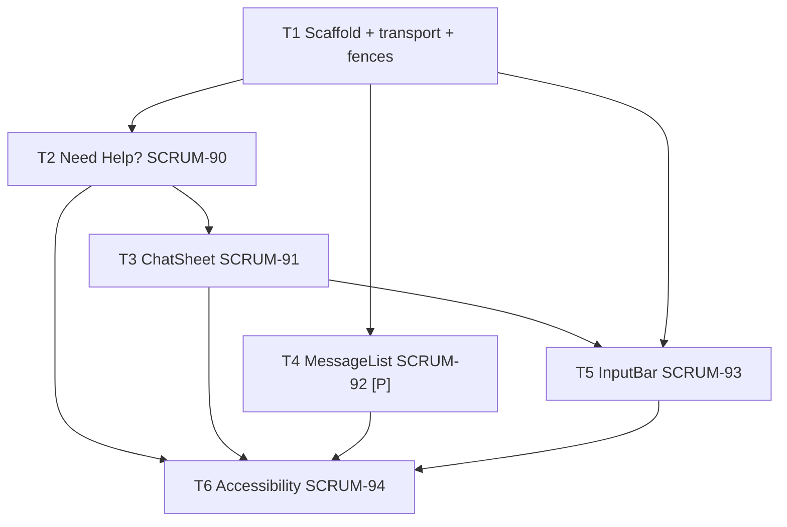

# Onboarding Chat UI Tasks

**Spec**: `.specs/features/onboarding-chat-ui/spec.md`
**Design**: `.specs/features/onboarding-chat-ui/design.md`
**Epic / Slice**: [SCRUM-140](https://csai420.atlassian.net/browse/SCRUM-140) — task issues SCRUM-90..94 exist and are enriched from this file; T1 needs one new child issue.
**Branch (planned)**: `feat/onboarding-chat-ui` — single slice branch; one atomic commit per task.
**Execution**: Runs in a separate session via `/sdd-execute-jira` — never inline with this planning session.

## Execution Protocol (MANDATORY -- do not skip)

Activate `tlc-spec-driven` by name and follow its Execute flow and Critical Rules. Do not search for
skill files by filesystem path. **If the skill cannot be activated, STOP and tell the user — do not
proceed without it.**

**Repo override (NON-NEGOTIABLE):** planning and execution are two separate sessions. This file is a
planning artifact; no source code is written in the session that produced it.

**UI skills (NON-NEGOTIABLE for T2–T6):** before writing component code, load
`.agents/skills/react-best-practices/SKILL.md` then `.agents/skills/web-design-guidelines/SKILL.md`,
in that order, per `.opencode/rules/react-ui-on-demand.md`. The shadcn MCP does **not** apply — it
emits web components, and this is React Native.

**Backend is read-only.** No task in this slice modifies anything under `src/`, `prisma/`, or
`__test__/`. The only non-`mobile/` edits are the additive toolchain fences in T1.

## Test Coverage Matrix

| Code Layer | Required Test Type | Coverage Expectation | Location Pattern | Run Command |
| --- | --- | --- | --- | --- |
| Transport (`mobile/app/api/`) | unit | Every status branch; base-URL resolution | `mobile/__tests__/chatClient.test.js` | `cd mobile && npx jest` |
| Pure logic (`mobile/app/lib/`) | unit | Every step; every validator accept + reject | `mobile/__tests__/stepRules.test.js` | `cd mobile && npx jest` |
| Components (`mobile/app/components/`, `screens/`) | component (RNTL) | Render, interaction, accessibility queries | `mobile/__tests__/<Component>.test.js` | `cd mobile && npx jest` |
| Root toolchain fences | regression | Root pipeline unchanged | existing suites | `npm run format && npm run lint && npm run typecheck && npm run test:unit` |

Tests are part of the task that changes behavior — never a separate task. This is why SCRUM-99
("Write Jest component tests") is absorbed rather than scheduled.

## Parallelism Assessment

| Test Type | Parallel-Safe? | Isolation Model | Evidence |
| --- | --- | --- | --- |
| Mobile unit | yes | Jest per-file module registry; `fetch` stubbed per test | No shared server, no DB |
| Mobile component | yes | RNTL renders into an isolated tree per test | No global state; `ChatSheet` state is component-local |
| Root regression | yes | Unchanged from today | Existing CI runs them in parallel jobs |

## Gate Check Commands

| Gate Level | Command |
| --- | --- |
| Mobile | `cd mobile && npx jest` |
| Root regression | `npm run format && npm run lint && npm run typecheck && npm run test:unit` |
| Full | Mobile + Root regression + `npm run build` |

## Execution Plan

### Phase 1: Foundation (Sequential)

- T1 — scaffold, transport, pure logic, toolchain fences. Everything else depends on it.

### Phase 2: Surface and Transcript (T4 parallel with T2→T3)

- T2 → T3 — entry point, then the container that owns session state.
- T4 [P] — `MessageList` is presentational and depends only on T1.

### Phase 3: Turn Handling (Sequential)

- T5 — `InputBar`, per-step validation, and final registration wiring.

### Phase 4: Accessibility (Sequential)

- T6 — touches every component from T2–T5, so it lands last.

## Task Breakdown

### T1: Scaffold `mobile/`, transport, and toolchain fences

**What**: Create the Expo application, the `chatClient` transport, the `stepRules` pure module, and
the session-id helper — and fence `mobile/` from every root toolchain entry point.

**Where**:
- `mobile/package.json`, `mobile/app.json`, `mobile/jest.config.js` (new)
- `mobile/app/index.js`, `mobile/app/App.js`, `mobile/app/screens/SignUpScreen.js` (new, placeholder screen)
- `mobile/app/api/chatClient.js`, `mobile/app/lib/stepRules.js`, `mobile/app/lib/session.js` (new)
- `mobile/__tests__/chatClient.test.js`, `mobile/__tests__/stepRules.test.js` (new)
- `tsconfig.json` (modify — add `"mobile"` to `exclude`)
- `.prettierignore` (modify — add `mobile/`)
- `eslint.config.mjs` (modify — add `'mobile/**'` to `ignores`)
- `.dockerignore` (modify — add `mobile`)
- `.github/workflows/ci.yml` (modify — add a `mobile` job)

**Depends on**: None

**Reuses**: rn2's named-async-export + `global.fetch = jest.fn()` test idiom
(`cs420-rn2-code-challenge-asf0/app/screens/NotificationScreen.js`); rn1's `useThemeStyles()` pattern
(`cs420-rn1-code-challenge-asf0/app/components/Styles.js`); validator rules from
`src/lib/schemas/chat-assisted-registration.schema.ts`; `splitName()` fallback from
`src/app/api/user/register-chat/route.ts:10`.

**Requirement**: FND-01 → FND-06

**Branch**: `feat/onboarding-chat-ui`

**Tools**:
- MCP: context7 (Expo SDK 54 / RNTL 13 API confirmation)
- Skill: NONE

**Done when**:
- [ ] `mobile/` runs under Expo SDK 54 / RN 0.81 / React 19 with `jest-expo` and RNTL 13
- [ ] `continueSession` posts to `{base}/chat/continue-session`; `registerChatAssisted` posts to `{base}/user/chat-assisted`; neither path carries an `/api` prefix (FND-03, FND-04)
- [ ] `registerChatAssisted` returns distinct outcomes for 201 / 400 / 408 / 409 / other (FND-04)
- [ ] Missing `extra.apiBaseUrl` raises an explicit configuration error (FND-05)
- [ ] `createChatSessionId()` returns distinct non-empty ids ≤128 chars (FND-06)
- [ ] `stepRules.fieldForStep` matches the design's normative table for all seven steps
- [ ] `stepRules.validate` accepts and rejects the same values as `ChatAssistedRegistrationSchema`
- [ ] All five fences applied; root pipeline green with `mobile/` present (FND-02)
- [ ] Gate passes: Full (test count: ≥ 20 mobile, no silent deletions)

**Tests**: unit
**Gate**: full
**Commit**: `feat(onboarding-chat-ui): scaffold Expo client with chat transport`

---

### T2: "Need Help?" entry point — SCRUM-90

**What**: Add the **Need Help?** control to the signup screen; pressing it mints a session id and
reveals the chat surface.

**Where**: `mobile/app/screens/SignUpScreen.js` (modify), `mobile/__tests__/SignUpScreen.test.js` (new)

**Depends on**: T1

**Reuses**: `createChatSessionId()` from T1; rn1's `TouchableOpacity` + `styles.button` /
`styles.buttonText` idiom — no `<Button>` component exists in the reference projects.

**Requirement**: HELP-01 → HELP-05

**Branch**: `feat/onboarding-chat-ui`

**Tools**:
- MCP: NONE
- Skill: `react-best-practices`, then `web-design-guidelines`

**Done when**:
- [ ] Control renders on the signup screen with `testID="need-help-button"` (HELP-01)
- [ ] Chat surface is not presented before the control is activated (HELP-02)
- [ ] Activating it presents the chat surface (HELP-03)
- [ ] Each activation mints a fresh id, distinct from the previous, ≤128 chars (HELP-04)
- [ ] Touch target is ≥44×44 points (HELP-05)
- [ ] Gate passes: Mobile (test count: ≥ 5, no silent deletions)

**Tests**: component
**Gate**: mobile
**Commit**: `feat(onboarding-chat-ui): add Need Help entry point to signup screen`

---

### T3: Chat surface owning session state — SCRUM-91

**What**: Implement `ChatSheet` — the modal/bottom-sheet container that holds session state, sends
the opener, and drives each turn.

**Where**: `mobile/app/components/chat/ChatSheet.js` (new),
`mobile/__tests__/ChatSheet.test.js` (new), `mobile/app/screens/SignUpScreen.js` (modify — mount it)

**Depends on**: T1, T2

**Reuses**: `chatClient` and `stepRules` from T1; `Alert.alert` error idiom from rn1's
`SignUpScreen.js`.

**Requirement**: SHEET-01 → SHEET-07

**Branch**: `feat/onboarding-chat-ui`

**Tools**:
- MCP: context7 (React Native `Modal` API)
- Skill: `react-best-practices`, then `web-design-guidelines`

**Done when**:
- [ ] Presents over the signup screen without navigating away (SHEET-01)
- [ ] On open, sends the opener and renders `"I'd be happy to help! What's your name?"` (SHEET-02)
- [ ] Dismisses via close control, backdrop press, and Android back (`onRequestClose`) (SHEET-03)
- [ ] Adopts `nextStep` from each response as the current step (SHEET-04)
- [ ] Network error and 500 surface a message and reset `pending` — never stuck (SHEET-05)
- [ ] 400 renders the returned `errors[]` content, not a generic message (SHEET-06)
- [ ] Reopening after dismissal starts a new session with an empty transcript (SHEET-07)
- [ ] Records `fieldForStep(previousStep)` into the accumulator after each successful turn
- [ ] Gate passes: Mobile (test count: ≥ 9, no silent deletions)

**Tests**: component
**Gate**: mobile
**Commit**: `feat(onboarding-chat-ui): add chat sheet owning session state`

---

### T4: Auto-scrolling transcript — SCRUM-92 [P]

**What**: Implement `MessageList` — ordered transcript, distinct user/assistant bubbles, auto-scroll,
and masked credential turn.

**Where**: `mobile/app/components/chat/MessageList.js` (new),
`mobile/__tests__/MessageList.test.js` (new)

**Depends on**: T1 *(parallel-safe with T2 and T3 — presentational, no shared files)*

**Reuses**: nothing beyond React Native; entries are `{role, message}` per
`src/lib/chat-session-repository.ts` `ChatContextEntry`.

**Requirement**: MSG-01 → MSG-05

**Branch**: `feat/onboarding-chat-ui`

**Tools**:
- MCP: NONE
- Skill: `react-best-practices`, then `web-design-guidelines`

**Done when**:
- [ ] Entries render in order with user and assistant visually distinguishable (MSG-01)
- [ ] Appending an entry scrolls the newest into view via `onContentSizeChange` (MSG-02)
- [ ] The credential turn renders masked; typed characters never reach a `Text` node (MSG-03)
- [ ] Transcript accumulates both turns per exchange (MSG-04)
- [ ] Long entries wrap; no horizontal scrolling (MSG-05)
- [ ] Masking keys off transcript index, not string equality
- [ ] Gate passes: Mobile (test count: ≥ 6, no silent deletions)

**Tests**: component
**Gate**: mobile
**Commit**: `feat(onboarding-chat-ui): add auto-scrolling message list`

---

### T5: Input bar, per-step validation, and registration — SCRUM-93

**What**: Implement `InputBar` with keyboard-avoiding layout and per-step keyboard configuration,
enforce per-step validation, and wire the final `/user/chat-assisted` submission.

**Where**: `mobile/app/components/chat/InputBar.js` (new),
`mobile/__tests__/InputBar.test.js` (new), `mobile/app/components/chat/ChatSheet.js` (modify — wire
completion)

**Depends on**: T1, T3

**Reuses**: `stepRules.validate` / `inputPropsForStep` / `splitName` and
`chatClient.registerChatAssisted` from T1; rn1's `disabled={loading}` + label-swap idiom from
`LoginScreen.js`.

**Requirement**: INPUT-01 → INPUT-15

**Branch**: `feat/onboarding-chat-ui`

**Tools**:
- MCP: context7 (`KeyboardAvoidingView` behavior per platform)
- Skill: `react-best-practices`, then `web-design-guidelines`

**Done when**:
- [ ] Submitting sends the text and clears the field (INPUT-01)
- [ ] Empty or whitespace-only input issues no request (INPUT-02)
- [ ] Input and submit stay visible with the keyboard presented (INPUT-03)
- [ ] Keyboard config matches the step: email / phone-pad / numeric / secure (INPUT-04)
- [ ] Submit is disabled while a request is in flight — no double turn (INPUT-05)
- [ ] Email, password, birthDate, phone and name rules each block advance with an inline error (INPUT-06 → INPUT-10)
- [ ] One-word name defaults the missing part to `"User"` (INPUT-10)
- [ ] `completion` posts accumulated `userData`; 201 confirms and dismisses (INPUT-11)
- [ ] 409 retains the session and lets the user retry the email (INPUT-12)
- [ ] 408 presents an expired state with a restart (INPUT-13)
- [ ] 400 renders returned `errors[]` (INPUT-14)
- [ ] `conversationLog` excludes the credential turn (INPUT-15)
- [ ] `lastActivity` sent is the last successful `continue-session` response time, not "now"
- [ ] Gate passes: Mobile (test count: ≥ 18, no silent deletions)

**Tests**: component + unit
**Gate**: mobile
**Commit**: `feat(onboarding-chat-ui): add input bar with per-step validation and registration`

---

### T6: Screen reader support and dynamic font scaling — SCRUM-94

**What**: Label every interactive element, announce assistant replies, and make the surface survive
maximum OS font scale.

**Where**: `mobile/app/components/chat/{ChatSheet,MessageList,InputBar}.js` (modify),
`mobile/app/screens/SignUpScreen.js` (modify), `mobile/__tests__/accessibility.test.js` (new)

**Depends on**: T2, T3, T4, T5

**Reuses**: `AccessibilityInfo` from React Native; `accessibilityMode` is already accepted by
`ChatAssistedRegistrationSchema`, so no backend change is needed to send it.

**Requirement**: A11Y-01 → A11Y-07

**Branch**: `feat/onboarding-chat-ui`

**Tools**:
- MCP: context7 (React Native accessibility API)
- Skill: `react-best-practices`, then `web-design-guidelines`

**Done when**:
- [ ] Every interactive element exposes a non-empty `accessibilityLabel` and an appropriate `accessibilityRole`, verified via `getByLabelText` (A11Y-01)
- [ ] Bubble announcements identify the speaker (A11Y-02)
- [ ] New assistant replies are announced via `accessibilityLiveRegion="polite"` and `announceForAccessibility` (A11Y-03)
- [ ] At maximum font scale no chat text is clipped, truncated, or overlapped (A11Y-04)
- [ ] `allowFontScaling` is not disabled anywhere; a bounded `maxFontSizeMultiplier` is set (A11Y-05)
- [ ] Sheet sets `accessibilityViewIsModal`; content behind is unreachable (A11Y-06)
- [ ] `accessibilityMode` is sent when a screen reader is active (A11Y-07)
- [ ] Gate passes: Full (test count: ≥ 10, no silent deletions)

**Tests**: component
**Gate**: full
**Commit**: `feat(onboarding-chat-ui): add screen reader labels and dynamic font scaling`

---

## Parallel Execution Map

## Task Granularity Check

| Task | Scope | Status |
| --- | --- | --- |
| T1 | Scaffold + transport + pure logic + fences — large, but indivisible: the app cannot exist half-scaffolded and the fences must land with it or CI breaks | ✅ |
| T2 | One control on one screen | ✅ |
| T3 | One container component | ✅ |
| T4 | One presentational component | ✅ |
| T5 | One component + the completion wiring it owns | ✅ |
| T6 | Cross-cutting by nature; scoped to accessibility attributes only | ✅ |

## Diagram-Definition Cross-Check

| Task | Depends On (task body) | Diagram Shows | Status |
| --- | --- | --- | --- |
| T1 | None | root | ✅ |
| T2 | T1 | T1 → T2 | ✅ |
| T3 | T1, T2 | T2 → T3 (T1 transitive) | ✅ |
| T4 | T1 | T1 → T4 | ✅ |
| T5 | T1, T3 | T1 → T5, T3 → T5 | ✅ |
| T6 | T2, T3, T4, T5 | all four → T6 | ✅ |

## Test Co-location Validation

| Task | Code Layer Created/Modified | Matrix Requires | Task Says | Status |
| --- | --- | --- | --- | --- |
| T1 | `mobile/app/api/`, `mobile/app/lib/`, root configs | unit + regression | unit, gate full | ✅ |
| T2 | `mobile/app/screens/` | component | component | ✅ |
| T3 | `mobile/app/components/` | component | component | ✅ |
| T4 | `mobile/app/components/` | component | component | ✅ |
| T5 | `mobile/app/components/` | component | component + unit | ✅ |
| T6 | `mobile/app/components/`, `screens/` | component | component, gate full | ✅ |
