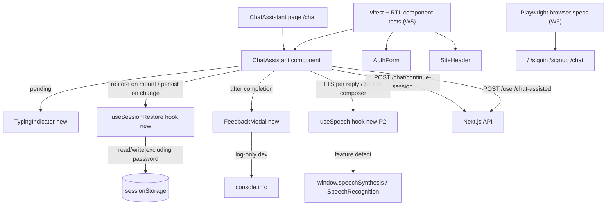

# Web Chat UI Enhancements Design

**Spec**: `.specs/features/web-chat-ui-enhancements/spec.md`
**Status**: Draft
**ADR**: none — the web MVP has not been ADR'd. A follow-up ADR could record the web-stack choice (Next.js App Router + hand-written `globals.css` design system, no Tailwind/shadcn); this slice does not require one.
**TDD**: none yet.

## Architecture Overview

The web frontend on `feat/web-mvp` is a Next.js 16 App Router + React 19 client. `ChatAssistant` (`src/components/chat-assistant.tsx`, 264 lines) owns all chat state in component `useState`/`useRef` and talks to two delivered endpoints — `POST /chat/continue-session` and `POST /user/chat-assisted` — exactly as the RN `ChatSheet` does. There is no global store, no context provider, and no backend in this slice.

This slice extends `ChatAssistant` with four additive concerns and a test layer:

- a `TypingIndicator` component (animated dots) replacing the plain `.chat-pending` text during `pending`;
- a `useSessionRestore` hook persisting/restoring `{ messages, currentStep, collected (excluding password), chatSessionId }` to `sessionStorage`;
- a `FeedbackModal` (inline, after completion) recording feedback log-only;
- a `useSpeech` hook wrapping `window.speechSynthesis` (TTS) and `window.SpeechRecognition`/`webkitSpeechRecognition` (STT) with feature detection (P2);
- vitest + RTL component tests and Playwright browser specs (the highest-value task — there is zero web UI test coverage today).



### State model (existing, extended)

`ChatAssistant` already holds (no DB, in-memory only):

- `sessionIdRef` — client-minted UUID via `crypto.randomUUID()` (`makeSessionId()`, line 52);
- `messages: ChatMessage[]` — transcript, `{ role, message }`;
- `currentStep: ChatStep` — one of the seven steps;
- `collected: CollectedFields` — `{ firstName?, lastName?, email?, phone?, birthDate?, password? }`;
- `draft`, `pending`, `feedback`, `complete`.

W2 adds a `useSessionRestore` effect that syncs the subset `{ messages, currentStep, collected (without `password`), chatSessionId }` to `sessionStorage` and rehydrates on mount.

## Code Reuse Analysis

### Existing Components to Leverage

| Component | Location | How to Use |
| --- | --- | --- |
| `ChatAssistant` | `src/components/chat-assistant.tsx` | The single stateful container; wire `TypingIndicator`, `useSessionRestore`, `FeedbackModal`, `useSpeech` into it. Reuse its `makeSessionId()`, `collectAnswer()`, `errorMessage()` helpers unchanged |
| `AuthForm` | `src/components/auth-form.tsx` | Test target for W5; reuse `signin`/`signup` `mode` prop and its `fetch`/feedback state shape. No behavior change in this slice |
| `SiteHeader` | `src/components/site-header.tsx` | Test target for W5; reuse skip-link + nav structure. No behavior change |
| `Step copy + step order` | `src/components/chat-assistant.tsx:32-50` (`STEP_ORDER`, `STEP_COPY`) | Source of truth for the step sequence asserted in tests; do not duplicate |
| `submitRegistration()` / `handleSubmit()` | `src/components/chat-assistant.tsx:97-168` | The fetch + completion wiring; W2 clears session on the `setComplete(true)` branch, W3 mounts `FeedbackModal` after `complete` |

### Existing CSS to Reuse

| Class | Location | How to Use |
| --- | --- | --- |
| `.chat-pending` | `src/app/globals.css:798` | The existing pending block; W1 adds `.typing-indicator` + `@keyframes typing` alongside it, keeping `.chat-pending` as the container |
| `.reveal` + `@keyframes reveal` | `src/app/globals.css:851-868` | The established CSS-keyframe animation pattern in this design system — mirror it for `@keyframes typing` |
| `@media (prefers-reduced-motion: reduce)` | `src/app/globals.css:870` | Already globally neutralizes animations; W1's typing dots inherit this for free — do not duplicate the media query |
| `.success-banner` | `src/app/globals.css:813` | W3's `FeedbackModal` mounts inside/after this block; reuse its grid + mark styling |
| `.status-message` / `.status-error` / `.status-success` | `src/app/globals.css:697-711` | Reuse for feedback submission state |
| `.button` / `.button-primary` / `.button-small` | `src/app/globals.css:154-209` | Reuse for all new affordances (Read aloud, voice input, feedback submit) — do not introduce a new button system |
| `.chat-message` / `.chat-message-assistant` / `.chat-message-user` | `src/app/globals.css:765-796` | W4's "Read aloud" control attaches per assistant reply bubble |

### Existing Test Infra to Reuse

| Infra | Location | How to Use |
| --- | --- | --- |
| `vitest.config.mts` | repo root | **Gap:** currently `environment: 'node'` and `include: ['__test__/unit/**/*.test.ts']` (no `.tsx`, no jsdom). W5-foundation must add a jsdom-enabled project or override for `*.test.tsx` and add `@testing-library/react` |
| `playwright.config.ts` | repo root | Already boots Next on port 3001 via `webServer`. W5 web e2e specs drop into `__test__/e2e/` and reuse `baseURL: http://127.0.0.1:3001` |
| `__test__/e2e/helpers/auth.helper.ts` | existing | API-only helper (`request.post`). W5 browser specs use `page` (not `request`) — a parallel browser helper is not needed; each spec navigates with `page.goto` |
| `@vitejs/plugin-react` | per `CONVENTIONS.md` | Needed for component JSX in vitest; W5-foundation verifies the plugin is active for the `.tsx` glob (it is referenced in conventions but not in the current config — confirm) |

### Integration Points

| System | Integration Method |
| --- | --- |
| `POST /chat/continue-session` | existing `fetch` in `ChatAssistant.handleSubmit`; reuse, do not modify |
| `POST /user/chat-assisted` | existing `fetch` in `submitRegistration`; reuse, do not modify |
| `sessionStorage` | `useSessionRestore` hook; `getItem`/`setItem`/`removeItem` under a stable key (e.g., `stedi.chat.session`) |
| `window.speechSynthesis` | `useSpeech` hook; `speechSynthesis.speak(new SpeechSynthesisUtterance(text))`; cancel on unmount |
| `window.SpeechRecognition` / `webkitSpeechRecognition` | `useSpeech` hook; feature-detect both spellings; `start()`/`stop()`; `onresult` → draft |
| Vitest | `npm run test:unit`; component tests under `src/components/__tests__/*.test.tsx` (W5 may add the glob) |
| Playwright | `npx playwright test`; browser specs under `__test__/e2e/web/*.spec.ts` |

## Components

### `TypingIndicator`

**Purpose**: Replace the plain `.chat-pending` italic text with three pulsing dots while a turn is in flight.

**Location**: `src/components/typing-indicator.tsx` (new)

**Behavior**:

1. Renders three `<span>` dots inside the existing `.chat-pending` container (reuses the container so the layout does not shift).
2. The dots pulse via a new `@keyframes typing` in `globals.css`, mirroring the existing `@keyframes reveal` pattern. Respects `@media (prefers-reduced-motion: reduce)` (already global at line 870).
3. Carries `aria-live="polite"` and a visually-hidden "STEDI is typing" label for screen readers (WEBLOAD-02).
4. Removed by the parent when `pending` is false (WEBLOAD-03).

**Interfaces**: `<TypingIndicator />` (no props).

**Dependencies**: none beyond React.

**Reuses**: `.chat-pending` container; `@keyframes reveal` as the keyframe pattern; global reduced-motion media query.

### `useSessionRestore` hook

**Purpose**: Persist and restore the in-progress chat session to `sessionStorage` so a tab refresh resumes the conversation (excluding the password).

**Location**: `src/lib/use-session-restore.ts` (new) — or inline in `ChatAssistant` if the hook adds indirection without clarity; design recommends the standalone hook for testability.

**Behavior**:

1. On `ChatAssistant` mount, reads `sessionStorage` under a stable key (e.g., `stedi.chat.session`). If present and parseable, hydrates `messages`, `currentStep`, `collected` (without `password`), and `sessionIdRef` (WEBRESTORE-02).
2. On state change (`messages`/`currentStep`/`collected`), writes the subset (debounced ~300ms) to `sessionStorage` (WEBRESTORE-01).
3. If the restored step is `password_collection`, the password field is empty and a notice tells the user to re-enter it (WEBRESTORE-03). The `password` key is never written to storage.
4. On successful registration (`setComplete(true)`), clears the key (WEBRESTORE-04).
5. If a restored `chatSessionId` yields a 408 on the next `continue-session`, discards the stored state and starts fresh (WEBRESTORE-05).
6. If `sessionStorage` is unavailable or the JSON is corrupt, fails silently to a fresh session (edge case).

**Interfaces**: `useSessionRestore()` returns `{ restore, persist, clear }` (or is wired as an effect inside `ChatAssistant`).

**Dependencies**: `sessionStorage` (feature-detected via `typeof window !== 'undefined'`).

**Reuses**: `ChatAssistant`'s existing state shape.

### `FeedbackModal`

**Purpose**: Inline feedback affordance shown after registration completes, recording feedback log-only.

**Location**: `src/components/feedback-modal.tsx` (new)

**Behavior**:

1. Renders after `.success-banner` when `complete` is true (WEBFEEDBACK-01). Asks "Was this onboarding helpful?" with a rating (e.g., a small set of buttons or a 1–5 scale).
2. On submit, records feedback via `console.info` gated by `process.env.NODE_ENV === 'development'` (WEBFEEDBACK-02). The submission is non-blocking — it does not delay or gate the success banner or the "Sign in" link.
3. On dismiss (close button or backdrop), no feedback is recorded and the user can still proceed to `/signin` (WEBFEEDBACK-03).
4. On submit or dismiss, the affordance closes (WEBFEEDBACK-04).
5. Does NOT call any backend route (the read-only-backend constraint).

**Interfaces**: `<FeedbackModal onSubmit={(rating) => void} onDismiss={() => void} />`

**Dependencies**: none beyond React.

**Reuses**: `.success-banner` grid; `.button`/`.button-small`; `.status-message` for the submitted state.

### `useSpeech` hook (P2)

**Purpose**: Wrap the Web Speech API for TTS (read assistant replies aloud) and STT (voice input), with feature detection and graceful degradation.

**Location**: `src/lib/use-speech.ts` (new)

**Behavior**:

1. TTS: `speak(text: string)` calls `window.speechSynthesis.speak(new SpeechSynthesisUtterance(text))` when `speechSynthesis` is available (WEBVOICE-01). Cancels any in-flight utterance on unmount.
2. STT: `start()`/`stop()` controls `window.SpeechRecognition`/`webkitSpeechRecognition`; `onresult` populates the composer draft (WEBVOICE-03).
3. Exposes `ttsSupported` and `sttSupported` booleans so the UI can hide the affordance where unsupported (WEBVOICE-02).
4. Handles permission denial / API errors by hiding the STT affordance and leaving the text composer fully usable.

**Interfaces**: `useSpeech()` returns `{ ttsSupported, sttSupported, speak, cancel, startListening, stopListening }`.

**Dependencies**: `window.speechSynthesis`, `window.SpeechRecognition`/`webkitSpeechRecognition` (feature-detected).

**Reuses**: nothing beyond the browser API.

### `ChatAssistant` (modified)

**Purpose**: Wire the four additive concerns into the existing container.

**Location**: `src/components/chat-assistant.tsx` (modify)

**Behavior**:

1. While `pending`, render `<TypingIndicator />` instead of the plain `.chat-pending` text (WEBLOAD-01).
2. On mount, restore from `sessionStorage` via `useSessionRestore`; on state change, persist (debounced); on completion, clear (WEBRESTORE-01..04).
3. After `complete`, mount `<FeedbackModal />` after the `.success-banner` (WEBFEEDBACK-01).
4. (P2) Render a "Read aloud" control on each assistant reply when `ttsSupported`; render a voice-input control in the composer when `sttSupported` (WEBVOICE-01..03).
5. No change to the `fetch` calls, the step machine, or the completion wiring.

**Dependencies**: `TypingIndicator`, `useSessionRestore`, `FeedbackModal`, `useSpeech` (P2).

**Reuses**: all existing helpers (`makeSessionId`, `collectAnswer`, `errorMessage`, `submitRegistration`, `handleSubmit`).

### Test files (new)

**Purpose**: Establish the web UI test layer (component + e2e) that does not exist today.

**Location**:

- `src/components/__tests__/site-header.test.tsx` (W5-foundation)
- `src/components/__tests__/auth-form.test.tsx` (W5-full)
- `src/components/__tests__/chat-assistant.test.tsx` (W5-full; W1/W2 extend)
- `src/components/__tests__/feedback-modal.test.tsx` (W3)
- `src/lib/__tests__/use-speech.test.ts` (W4)
- `__test__/e2e/web/home.spec.ts` (W5-foundation)
- `__test__/e2e/web/signin.spec.ts`, `signup.spec.ts`, `chat.spec.ts` (W5-full)

**Behavior**: component tests use vitest + RTL with mocked `fetch`; e2e specs use Playwright `page` against the running Next server on port 3001. Assert spec-defined outcomes, never implementation shape.

**Dependencies**: `@testing-library/react`, `@testing-library/dom`, `@testing-library/user-event` (devDeps added in W5-foundation), vitest jsdom environment.

## Data Models

No database changes. The `sessionStorage` shape (W2):

```
StediChatSession {
  messages: { role: 'assistant' | 'user'; message: string }[]
  currentStep: ChatStep
  collected: {
    firstName?: string
    lastName?: string
    email?: string
    phone?: string
    birthDate?: string
    // password NEVER persisted
  }
  chatSessionId: string
}
```

**Password exclusion**: the `password` field is stripped before every write. If the restored step is `password_collection`, `collected.password` is absent and the user is re-prompted (WEBRESTORE-03).

## Error Handling Strategy

| Error Scenario | Handling | User Impact |
| --- | --- | --- |
| `sessionStorage` unavailable / disabled | `useSessionRestore` catches, starts a fresh session | No restore; chat works normally |
| Stored JSON corrupt / wrong shape | Discard, start fresh | No restore; chat works normally |
| Restored `chatSessionId` 408 on resume | Discard stored state, mint a new id, start at greeting | Sees a fresh conversation start |
| `speechSynthesis` unavailable | `ttsSupported=false`; no "Read aloud" control rendered | Text-only; no impact |
| `SpeechRecognition` permission denied / throws | `sttSupported=false` or hide; text composer remains usable | Text-only; no impact |
| Feedback log write throws | Swallow silently (log-only) | No impact on success state |
| `continue-session` / `chat-assisted` failures | Unchanged from today (`feedback` state, retryable) | Unchanged |

## Risks & Concerns

| Concern | Location | Impact | Mitigation |
| --- | --- | --- | --- |
| Password persisted to `sessionStorage` | `useSessionRestore` write path | High — credential at rest in tab storage | Strip `password` before every write; re-prompt on restore; test asserts the key is absent |
| Browser Web Speech API variance | `useSpeech` | Medium — Safari good, Firefox partial for STT | Feature-detect; hide affordance where unsupported; P2 priority |
| `@testing-library/react` not in devDeps | `package.json` | High — component tests cannot run without it | W5-foundation adds `@testing-library/react`, `@testing-library/dom`, `@testing-library/user-event` as devDeps |
| Vitest config is `node` env, `*.test.ts` only | `vitest.config.mts` | High — component `.tsx` tests need jsdom + the `.tsx` glob | W5-foundation adds a jsdom-enabled project/override and the `*.test.tsx` include pattern |
| Playwright web UI specs need a running browser server | `playwright.config.ts` | Low — `webServer` already boots Next on port 3001 | Reuse existing config; specs use `page.goto` |
| `localStorage` vs `sessionStorage` scope | `useSessionRestore` | Medium — wrong scope persists across tabs | Use `sessionStorage` (cleared on tab close); documented as a tech decision |
| Reduced-motion users see a static indicator | `TypingIndicator` | Low | Global `@media (prefers-reduced-motion: reduce)` already neutralizes animations (line 870); inherit it |
| Client components can't import server Winston logger | `FeedbackModal` | Medium — direct import breaks the RSC boundary | Use `console.info` gated by `NODE_ENV`; document a follow-up backend `POST /feedback` slice |

## Tech Decisions

| Decision | Choice | Rationale |
| --- | --- | --- |
| Session storage | `sessionStorage`, not `localStorage` | Tab-scoped: refresh restores, new tab starts fresh — matches the "tab refresh" analog of RN's "app minimize" |
| Typing animation | CSS `@keyframes` in `globals.css`, no new dep | Mirrors the existing `@keyframes reveal` pattern; no JS animation library in the stack |
| Test library | `@testing-library/react` + `@testing-library/dom` + `@testing-library/user-event` (devDeps) | Idiomatic for React 19 component testing; vitest + jsdom per `CONVENTIONS.md` |
| Feedback recording | `console.info` gated by `NODE_ENV === 'development'` | Client components can't import server Winston; preserves the read-only-backend constraint; a follow-up backend slice can add `POST /feedback` |
| Web Speech API | Feature-detect `window.speechSynthesis` and `window.SpeechRecognition`/`webkitSpeechRecognition`; hide where unsupported | Uneven browser support; graceful degradation; P2 priority |
| Styling | Reuse `globals.css` classes; no Tailwind/shadcn | The web client uses a hand-written design system; introducing a new styling system is out of scope |
| No backend changes | Reuse `/chat/continue-session` and `/user/chat-assisted` as-is | Backend is delivered and covered by its suite; read-only |

> **Project-level decisions**: none recorded as ADRs yet. The web-MVP stack choice (Next.js App Router + `globals.css`, no Tailwind/shadcn) is a candidate for a future ADR but is not required by this slice. Feature-local decisions stay here.