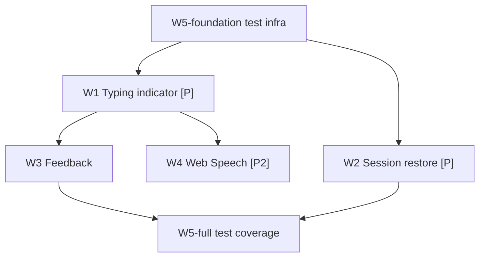

# Web Chat UI Enhancements Tasks

**Spec**: `.specs/features/web-chat-ui-enhancements/spec.md`
**Design**: `.specs/features/web-chat-ui-enhancements/design.md`
**Epic / Slice**: TBD — new web MVP epic to be created by `/sdd-tasks-jira` (e.g., "EPIC 17: Web MVP Chat Enhancements"); task issues W1–W5 will be published under it. Not yet in Jira.
**Branch (planned)**: `feat/web-mvp` — current branch; add commits here, do not create a separate branch per the user's instruction. One atomic commit per task.
**Execution**: Runs in a separate session via `/sdd-execute-jira` — never inline with this planning session.

## Execution Protocol (MANDATORY -- do not skip)

Activate `tlc-spec-driven` by name and follow its Execute flow and Critical Rules. Do not search for
skill files by filesystem path. **If the skill cannot be activated, STOP and tell the user — do not
proceed without it.**

**Repo override (NON-NEGOTIABLE):** planning and execution are two separate sessions. This file is a
planning artifact; no source code is written in the session that produced it.

**UI skills (NON-NEGOTIABLE for W1–W4):** before writing component code, load
`.agents/skills/react-best-practices/SKILL.md` then `.agents/skills/web-design-guidelines/SKILL.md`,
in that order, per `.opencode/rules/react-ui-on-demand.md`. The shadcn MCP MAY apply for web
components in general, but this slice **reuses the hand-written `globals.css` design system** — do
NOT invoke shadcn to emit Tailwind-based components. For component architecture concerns
(compound components, render props) also load
`.agents/skills/react-composition-patterns/SKILL.md`.

**Backend is read-only.** No task in this slice modifies anything under `src/app/api/`, `src/app/auth/`,
`src/app/chat/`, `src/app/user/`, `src/lib/` server modules, `prisma/`, or `__test__/` existing
helpers. Feedback (W3) is log-only — `console.info` gated by `NODE_ENV === 'development'`; a
follow-up backend slice could add `POST /feedback`, but that is out of scope here.

## Test Coverage Matrix

| Code Layer | Required Test Type | Coverage Expectation | Location Pattern | Run Command |
| --- | --- | --- | --- | --- |
| Components (`src/components/`) | component (vitest + RTL) | Render, interaction, accessibility queries, feedback states | `src/components/__tests__/*.test.tsx` | `npm run test:unit` |
| Hooks (`src/lib/use-*.ts`) | unit (vitest) | Feature detection branches, effect cleanup | `src/lib/__tests__/*.test.ts` | `npm run test:unit` |
| Web pages (`/`, `/signin`, `/signup`, `/chat`) | e2e (Playwright browser) | Page render, form submit, chat panel | `__test__/e2e/web/*.spec.ts` | `npx playwright test` |
| Root toolchain | regression | Root pipeline unchanged with new tests | existing suites | `npm run lint && npm run typecheck && npm run build` |

Tests are part of the task that changes behavior — never a separate task. This is why W5 is split:
**W5-foundation** sets up the test infra and the first tests so W1–W4 each ship with their own tests,
and **W5-full** completes the coverage matrix afterward.

## Parallelism Assessment

| Test Type | Parallel-Safe? | Isolation Model | Evidence |
| --- | --- | --- | --- |
| Component (vitest + RTL) | yes | RTL renders into an isolated DOM per test; `fetch` stubbed per test | No shared server, no DB; `ChatAssistant` state is component-local |
| Hook unit (vitest) | yes | Pure functions / mocked browser APIs | No global state |
| Playwright web e2e | yes | Playwright per-worker browser context; `webServer` boots Next on 3001 | `fullyParallel: true` in config; specs use `page.goto` |
| Root regression | yes | Unchanged from today | Existing CI runs them in parallel jobs |

## Gate Check Commands

| Gate Level | Command |
| --- | --- |
| Web | `npm run test:unit && npm run lint && npm run typecheck` |
| Full | Web + `npm run build` + `npx playwright test __test__/e2e/web` |

## Execution Plan

### Phase 1: Test Foundation (Sequential)

- **W5-foundation** — set up RTL + jsdom + the `*.test.tsx` glob, add the first component test
  (`SiteHeader`) and the first Playwright web spec (`/`). Establishes the foundation so W1–W4
  each ship with their own tests. **Everything else depends on it.**

### Phase 2: Typing + Restore (Parallel)

- **W1** [P] — `TypingIndicator` + keyframes; pure CSS + a small component, parallel-safe with W2.
- **W2** [P] — `useSessionRestore` + `sessionStorage` wiring; touches `ChatAssistant` state but a
  different concern than W1. Merge order: W1 then W2 (or W2 then W1) — both modify
  `chat-assistant.tsx`, so integrate linearly via rebase.

### Phase 3: Feedback (Sequential)

- **W3** — `FeedbackModal` after completion; depends on W1 (the success/complete path is stable).

### Phase 4: Speech (P2 — may defer)

- **W4** — `useSpeech` TTS + STT; depends on W1. P2 priority — if scope is tight, defer to a
  follow-up slice (the spec marks W4 as P2/deferred).

### Phase 5: Full Test Coverage (Sequential)

- **W5-full** — complete the component + e2e coverage matrix; depends on W1, W2, W3 (so the tests
  assert the final behavior of all three).

## Task Breakdown

### W5-foundation: Set up web test infrastructure — Jira TBD (WEBTEST-01,04,06 partial)

**What**: Add the React Testing Library devDeps, configure vitest for jsdom + `*.test.tsx`, write the
first component test (`SiteHeader`) and the first Playwright browser spec (`/`). Establishes the
foundation so W1–W4 each ship with their own tests.

**Where**:
- `package.json` (modify — add `@testing-library/react`, `@testing-library/dom`, `@testing-library/user-event` to `devDependencies` IF not present)
- `vitest.config.mts` (modify — add a jsdom-enabled project/override for `*.test.tsx`; ensure `@vitejs/plugin-react` is active for the component glob)
- `src/components/__tests__/site-header.test.tsx` (new)
- `__test__/e2e/web/home.spec.ts` (new)

**Depends on**: `feat/web-mvp` branch

**Reuses**: `vitest.config.mts` existing alias for `@/`; `playwright.config.ts` `webServer` on port 3001; `SiteHeader` (`src/components/site-header.tsx`).

**Requirement**: WEBTEST-03, WEBTEST-04 (partial — full coverage in W5-full)

**Branch**: `feat/web-mvp`

**Tools**:
- MCP: context7 (`@testing-library/react` + vitest jsdom project config confirmation)
- Skill: NONE (infra setup)

**Done when**:
- [ ] `@testing-library/react`, `@testing-library/dom`, `@testing-library/user-event` present in `devDependencies`
- [ ] `npm run test:unit` runs `src/components/__tests__/site-header.test.tsx` under jsdom (WEBTEST-03)
- [ ] `SiteHeader` test asserts: render, the "STEDI home" wordmark link, the primary nav links, and the "Skip to content" skip link
- [ ] `npx playwright test __test__/e2e/web` runs `home.spec.ts` against the booted Next server (WEBTEST-04)
- [ ] `home.spec.ts` navigates to `/` and asserts the hero (`#hero-title`), primary nav, and the CTAs (`Create an account`, `Try guided signup`) render
- [ ] Gate passes: Web (test count: ≥ 2 component + ≥ 1 e2e, no silent deletions)

**Tests**: component + e2e
**Gate**: web
**Commit**: `test(web): add RTL component test infra and first web e2e spec`

---

### W1: Animated typing indicator — Jira TBD (WEBLOAD-01-03)

**What**: Replace the plain `.chat-pending` italic text with an animated `TypingIndicator` (three
pulsing dots) via CSS keyframes, with an accessible `aria-live="polite"` announcement.

**Where**:
- `src/components/typing-indicator.tsx` (new)
- `src/app/globals.css` (modify — add `@keyframes typing` + `.typing-indicator` / `.typing-dot` classes alongside `.chat-pending`)
- `src/components/chat-assistant.tsx` (modify — render `<TypingIndicator />` inside the existing `.chat-pending` block while `pending`)
- `src/components/__tests__/chat-assistant.test.tsx` (modify/add — assert the indicator renders during pending and is removed on completion)

**Depends on**: W5-foundation

**Reuses**: `.chat-pending` container (`globals.css:798`); `@keyframes reveal` (`globals.css:859`) as the keyframe pattern; global `@media (prefers-reduced-motion: reduce)` (`globals.css:870`) inherits for free.

**Requirement**: WEBLOAD-01, WEBLOAD-02, WEBLOAD-03

**Branch**: `feat/web-mvp`

**Tools**:
- MCP: NONE
- Skill: `react-best-practices`, then `web-design-guidelines`

**Done when**:
- [ ] While `pending`, the chat shows three pulsing dots instead of the plain "STEDI is thinking…" text (WEBLOAD-01)
- [ ] The indicator carries `aria-live="polite"` with a visually-hidden "STEDI is typing" label (WEBLOAD-02)
- [ ] On request completion (success or failure), the indicator is removed and replaced with the result (WEBLOAD-03)
- [ ] `@keyframes typing` mirrors the `@keyframes reveal` pattern; reduced-motion users see a static indicator (no new media query needed)
- [ ] Component test asserts the indicator renders during pending and is absent after completion
- [ ] Gate passes: Web (test count: ≥ 2 new, no silent deletions)

**Tests**: component
**Gate**: web
**Commit**: `feat(web): add animated typing indicator to chat assistant`

---

### W2: Session restore via sessionStorage — Jira TBD (WEBRESTORE-01-05)

**What**: Persist `{ messages, currentStep, collected (excluding password), chatSessionId }` to
`sessionStorage` and restore on mount so a tab refresh resumes the conversation.

**Where**:
- `src/lib/use-session-restore.ts` (new) — or inline in `ChatAssistant` if the hook adds indirection; design recommends the standalone hook for testability
- `src/components/chat-assistant.tsx` (modify — wire restore on mount, persist on state change (debounced), clear on completion, discard on 408)
- `src/components/__tests__/chat-assistant.test.tsx` (modify — assert restore, persist, clear, password exclusion, 408 discard)

**Depends on**: W5-foundation

**Reuses**: `ChatAssistant`'s existing state shape (`messages`, `currentStep`, `collected`, `sessionIdRef`).

**Requirement**: WEBRESTORE-01, WEBRESTORE-02, WEBRESTORE-03, WEBRESTORE-04, WEBRESTORE-05

**Branch**: `feat/web-mvp`

**Tools**:
- MCP: NONE
- Skill: `react-best-practices`, then `web-design-guidelines`

**Done when**:
- [ ] On turn send, the subset `{ messages, currentStep, collected (without password), chatSessionId }` is persisted to `sessionStorage` under a stable key (WEBRESTORE-01)
- [ ] On mount, if persisted state exists, the transcript and step restore, resuming at the saved step (WEBRESTORE-02)
- [ ] If the restored step is `password_collection`, the password field is empty and the user is informed to re-enter it; the `password` key is never written to storage (WEBRESTORE-03)
- [ ] On successful registration, the persisted state is cleared from `sessionStorage` (WEBRESTORE-04)
- [ ] If a restored `chatSessionId` yields a 408 on resume, the stored state is discarded and a fresh session starts (WEBRESTORE-05)
- [ ] Writes are debounced (~300ms) so rapid refresh / typing does not thrash the storage API
- [ ] If `sessionStorage` is unavailable or JSON is corrupt, the chat starts fresh (no crash)
- [ ] Component test asserts password is absent from the persisted JSON (critical security assertion)
- [ ] Gate passes: Web (test count: ≥ 5 new, no silent deletions)

**Tests**: component
**Gate**: web
**Commit**: `feat(web): add sessionStorage chat restore excluding password`

---

### W3: Post-chat feedback — Jira TBD (WEBFEEDBACK-01-04)

**What**: Add a `FeedbackModal` (inline, after completion) that asks "Was this onboarding helpful?"
and records the rating log-only (`console.info` gated by `NODE_ENV === 'development'`).

**Where**:
- `src/components/feedback-modal.tsx` (new)
- `src/components/chat-assistant.tsx` (modify — mount `FeedbackModal` after `.success-banner` when `complete`)
- `src/components/__tests__/feedback-modal.test.tsx` (new)

**Depends on**: W1 (the success/complete path is stable)

**Reuses**: `.success-banner` grid (`globals.css:813`); `.button`/`.button-small`; `.status-message` for the submitted state.

**Requirement**: WEBFEEDBACK-01, WEBFEEDBACK-02, WEBFEEDBACK-03, WEBFEEDBACK-04

**Branch**: `feat/web-mvp`

**Tools**:
- MCP: NONE
- Skill: `react-best-practices`, then `web-design-guidelines`

**Done when**:
- [ ] After completion, a feedback affordance appears asking "Was this onboarding helpful?" with a rating mechanism (WEBFEEDBACK-01)
- [ ] On submit, feedback is recorded via `console.info` gated by `NODE_ENV === 'development'` (log-only); the submission does NOT block the success state or the "Sign in" link (WEBFEEDBACK-02)
- [ ] On dismiss, no feedback is recorded and dismissal does not block proceeding to `/signin` (WEBFEEDBACK-03)
- [ ] On submit or dismiss, the affordance closes (WEBFEEDBACK-04)
- [ ] No backend route is called (read-only backend)
- [ ] Component test asserts submit, dismiss, and the non-blocking behavior
- [ ] Gate passes: Web (test count: ≥ 4 new, no silent deletions)

**Tests**: component
**Gate**: web
**Commit**: `feat(web): add post-chat feedback affordance`

---

### W4: Web Speech API (TTS + STT) — Jira TBD (WEBVOICE-01-03) — P2, may defer

**What**: Add a `useSpeech` hook wrapping `window.speechSynthesis` (TTS — read assistant replies
aloud) and `window.SpeechRecognition`/`webkitSpeechRecognition` (STT — voice input), with feature
detection and graceful degradation.

**Where**:
- `src/lib/use-speech.ts` (new)
- `src/components/chat-assistant.tsx` (modify — render a "Read aloud" control on each assistant reply when `ttsSupported`; render a voice-input control in the composer when `sttSupported`)
- `src/lib/__tests__/use-speech.test.ts` (new)

**Depends on**: W1

**Reuses**: nothing beyond the browser Web Speech API.

**Requirement**: WEBVOICE-01, WEBVOICE-02, WEBVOICE-03

**Branch**: `feat/web-mvp`

**Tools**:
- MCP: context7 (Web Speech API — `SpeechSynthesisUtterance`, `SpeechRecognition` event shapes)
- Skill: `react-best-practices`, then `web-design-guidelines`

**Done when**:
- [ ] When `window.speechSynthesis` is available, a "Read aloud" affordance appears on each assistant reply and synthesizes speech from the reply text (WEBVOICE-01)
- [ ] When speech synthesis is unsupported, the affordance is NOT rendered (WEBVOICE-02)
- [ ] When `window.SpeechRecognition`/`webkitSpeechRecognition` is available, a voice-input affordance appears in the composer; `onresult` populates the draft (WEBVOICE-03)
- [ ] On unmount, in-flight utterances are cancelled (not orphaned)
- [ ] Permission denial / API errors hide the STT affordance; the text composer remains fully usable
- [ ] Unit test asserts feature-detection branches and cleanup
- [ ] Gate passes: Web (test count: ≥ 4 new, no silent deletions)

**Tests**: unit
**Gate**: web
**Commit**: `feat(web): add Web Speech API TTS and STT (P2)`

---

### W5-full: Complete web UI test coverage — Jira TBD (WEBTEST-02,03,05,07,08)

**What**: Complete the component + e2e coverage matrix — `AuthForm` and full `ChatAssistant`
component tests, plus Playwright browser specs for `/signin`, `/signup`, and `/chat`.

**Where**:
- `src/components/__tests__/auth-form.test.tsx` (new)
- `src/components/__tests__/chat-assistant.test.tsx` (complete — step progression, pending state, completion, error handling)
- `__test__/e2e/web/signin.spec.ts` (new)
- `__test__/e2e/web/signup.spec.ts` (new)
- `__test__/e2e/web/chat.spec.ts` (new)

**Depends on**: W1, W2, W3 (so the tests assert the final behavior of typing indicator, session restore, and feedback)

**Reuses**: `auth.helper.ts` pattern (API-only — not used for browser specs); `playwright.config.ts` `webServer`; the RTL infra from W5-foundation.

**Requirement**: WEBTEST-01, WEBTEST-02, WEBTEST-05, WEBTEST-06, WEBTEST-07, WEBTEST-08

**Branch**: `feat/web-mvp`

**Tools**:
- MCP: context7 (`@testing-library/react` async patterns; Playwright `page` API)
- Skill: `react-best-practices` (component test ergonomics)

**Done when**:
- [ ] `AuthForm` component test covers signin + signup modes, validation, and feedback states (WEBTEST-01)
- [ ] `ChatAssistant` component test covers step progression, pending state, completion, and error handling (WEBTEST-02)
- [ ] Playwright `/signin` and `/signup` specs assert the forms render with the expected fields (WEBTEST-05)
- [ ] Playwright `/chat` spec asserts the chat panel, initial assistant message, and composer render (WEBTEST-06)
- [ ] Playwright `/signup` spec fills the form and submits, asserting the success/error feedback renders (mocked or against seeded data) (WEBTEST-07)
- [ ] `npm run lint` passes on all new test files (no unused vars, import order correct) (WEBTEST-08)
- [ ] Gate passes: Full (test count: ≥ 10 new across component + e2e, no silent deletions)

**Tests**: component + e2e
**Gate**: full
**Commit**: `test(web): complete component and e2e coverage for web UI`

---

## Parallel Execution Map

## Task Granularity Check

| Task | Scope | Status |
| --- | --- | --- |
| W5-foundation | DevDeps + vitest jsdom config + 1 component test + 1 e2e spec — indivisible: the infra must land together or no component test can run | ✅ |
| W1 | One new component + keyframes + a small `ChatAssistant` edit | ✅ |
| W2 | One new hook + `ChatAssistant` state wiring + password-exclusion tests | ✅ |
| W3 | One new component + a `ChatAssistant` mount point | ✅ |
| W4 | One new hook + `ChatAssistant` affordances — P2, may defer | ✅ |
| W5-full | Test files only — no behavior change; completes the matrix | ✅ |

## Diagram-Definition Cross-Check

| Task | Depends On (task body) | Diagram Shows | Status |
| --- | --- | --- | --- |
| W5-foundation | feat/web-mvp branch | root | ✅ |
| W1 | W5-foundation | W5f → W1 | ✅ |
| W2 | W5-foundation | W5f → W2 | ✅ |
| W3 | W1 | W1 → W3 | ✅ |
| W4 | W1 | W1 → W4 | ✅ |
| W5-full | W1, W2, W3 | W3 → W5, W2 → W5 (W1 transitive via W3) | ✅ |

## Test Co-location Validation

| Task | Code Layer Created/Modified | Matrix Requires | Task Says | Status |
| --- | --- | --- | --- | --- |
| W5-foundation | `src/components/__tests__/`, `__test__/e2e/web/`, configs | component + e2e + regression | component + e2e, gate web | ✅ |
| W1 | `src/components/` | component | component | ✅ |
| W2 | `src/lib/`, `src/components/` | component | component | ✅ |
| W3 | `src/components/` | component | component | ✅ |
| W4 | `src/lib/`, `src/components/` | unit | unit | ✅ |
| W5-full | `src/components/__tests__/`, `__test__/e2e/web/` | component + e2e | component + e2e, gate full | ✅ |