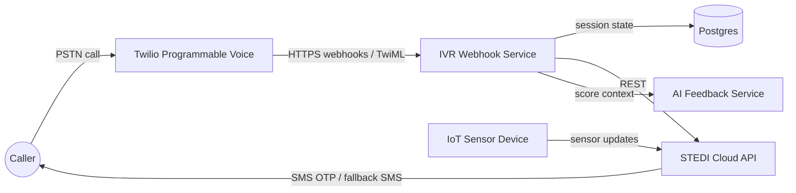

# TDD - STEDI Voice IVR

| Field           | Value                                                                        |
| --------------- | ---------------------------------------------------------------------------- |
| Tech Lead       | @Jared                                                                       |
| Product Manager | TBD                                                                          |
| Team            | Group 1                                                                      |
| Epic/Ticket     | TBD                                                                          |
| Related PRD     | [`2026-07-stedi-voice-ivr.md`](../../product/prd/2026-07-stedi-voice-ivr.md) |
| STEDI API Docs  | [https://dev.stedi.me/openapi-ui/](https://dev.stedi.me/openapi-ui/)         |
| Status          | Draft                                                                        |
| Created         | 2026-07-02                                                                   |
| Last Updated    | 2026-07-04                                                                   |

## Context

STEDI helps users monitor fall risk by performing a balance and mobility test with an
IoT sensor device. Today, the test is driven by a mobile app: the user authenticates
with SMS, navigates the app, starts the exercise, and views the resulting balance
index score on screen. Sensor data is processed by the existing STEDI cloud API,
which stores step tests and computes the risk or balance score.

STEDI Voice adds a second, hands-free channel: an automated phone assistant. A user
calls a designated phone number, authenticates entirely over the phone, is verbally
guided through the balance test while their IoT device streams sensor data to the
STEDI cloud, and hears their balance index score during the same call.

**Background**: The PRD leaves stack selection to engineering. This TDD selects the
prototype architecture and records the contracts, boundaries, risks, and delivery
strategy needed before slice planning begins.

**Domain**: Health monitoring and fall-risk assessment. Scores announced over the
phone are health-related data, so authentication, privacy, logging, and retry
behavior are first-order design concerns.

**Stakeholders**: Elderly users and users with physical or technical limitations,
STEDI product and clinical stakeholders, compliance reviewers, and the Group 1
engineering team building and operating the prototype.

## Problem Statement & Motivation

### Problems We're Solving

- **App dependency excludes the primary user base**: Elderly users and users with
  physical limitations can struggle with app navigation, touch interactions, and
  manually starting the exercise.
    - Impact: The users who most need regular balance testing are among the least able
      to complete it.
- **High interaction friction lowers testing frequency**: Device compatibility, app
  updates, and connectivity issues can interrupt the current flow.
    - Impact: Missed or abandoned tests reduce longitudinal data and weaken fall-risk
      monitoring.
- **No non-visual channel exists**: Users currently need a smartphone screen to
  complete the exercise.
    - Impact: Voice-first or low-tech users cannot complete the test independently.

### Why Now?

- The STEDI cloud API already exposes the main capabilities the voice channel needs:
  2FA, birth-date verification, sensor update polling, step-test submission, and
  risk scoring.
- Telephony and serverless hosting make an IVR prototype achievable without building
  a new device or scoring platform.
- The PRD identifies stack selection as the immediate prerequisite to prototype
  development.

### Impact of NOT Solving

- **Users**: The highest-friction population remains dependent on the mobile app.
- **Business/Product**: Accessibility and adoption goals remain unmet.
- **Technical**: The team does not validate whether the existing cloud API can
  support a second channel with score parity.

## Scope

### In Scope (V1 Prototype)

- Inbound call handling on one designated Twilio phone number.
- Caller authentication fully inside the call: SMS one-time code entered by keypad,
  plus patient name and date of birth verification.
- Clear, paced verbal guidance through the balance and mobility test.
- Phone-to-sensor readiness verification before the exercise.
- Sensor data collection through the existing STEDI cloud pipeline while the IVR
  observes recent updates.
- Step-test submission and balance index score retrieval from the STEDI API.
- Same-call score announcement when scoring completes within the call budget.
- Short personalized verbal feedback generated from the score.
- Failure handling for authentication, device readiness, scoring timeout, and call
  drops.
- SMS fallback delivery when score announcement cannot complete during the call.

### Out of Scope (V1)

- Replacing or deprecating the mobile app.
- Exercises other than the balance and mobility test.
- Smart-speaker integrations.
- Multilingual prompts.
- Voice-recognition or speaker-identification authentication.
- A free-form conversational AI agent.
- New device firmware or changes to the IoT device data path.
- Outbound system-initiated calls.

### Future Considerations (V2+)

- Conversational voice agent for natural dialogue.
- Dedicated queueing or event streaming if polling recent sensor updates is
  insufficient.
- Multilingual prompts and alternate OTP delivery channels.
- Scheduled reminders by call or SMS.
- Production-grade HIPAA-eligible vendor configuration and compliance review.

## Technical Solution

### Technology Stack Decision

| Concern                   | Choice                                                       | Rationale                                                                                                                                                |
| ------------------------- | ------------------------------------------------------------ | -------------------------------------------------------------------------------------------------------------------------------------------------------- |
| Telephony / IVR           | Twilio Programmable Voice with classic TwiML                 | Deterministic prompts and DTMF keypad input are reliable for OTP and date entry; webhook model fits serverless route handlers.                           |
| Text-to-speech            | Twilio `<Say>` with a clear supported voice                  | Keeps speech generation inside the telephony platform and avoids another real-time audio dependency.                                                     |
| Compute / hosting         | Existing Next.js 15 App Router route handlers on Vercel      | Matches this repository's current stack and maps naturally to Twilio webhook endpoints.                                                                  |
| AI feedback               | OpenAI via server-side integration or Vercel AI Gateway      | Generates short score feedback outside the real-time audio path so it cannot stall the core call flow.                                                   |
| Session state             | Postgres using Prisma                                        | Twilio webhooks are stateless; durable call sessions support resume, attempt limiting, observability, and fallback.                                      |
| Exercise data and scoring | Existing STEDI cloud API                                     | Keeps score generation in the system of record and supports score parity with the mobile app.                                                            |
| Eventing / queue          | STEDI's existing ingestion pipeline plus webhook transitions | The prototype does not need a separate queue if recent sensor polling and STEDI's existing pipeline satisfy the V1 latency and reliability requirements. |

### Architecture Overview

The IVR service is a thin orchestration layer. Twilio owns the phone call and speech
prompt execution. This repo owns webhook routes that advance a persisted call state
machine, call the STEDI API, and return TwiML. STEDI remains the source of truth for
customer data, device updates, step tests, and scoring.

**Key Components**:

- **Twilio Programmable Voice**: Answers the designated number, speaks TwiML prompts,
  gathers keypad input, and sends call lifecycle callbacks.
- **IVR Webhook Service**: Next.js route handlers that validate Twilio requests,
  load session state, call STEDI APIs, and return TwiML.
- **Call Session Store**: Postgres persistence for call state, attempts, timestamps,
  and short-lived tokens.
- **STEDI Cloud API**: Source of truth for customer identity, 2FA, sensor updates,
  rapid step tests, risk scores, and SMS fallback.
- **IoT Sensor Device**: Streams sensor updates to STEDI. The IVR does not connect
  directly to the device.
- **AI Feedback Service**: Generates concise score feedback using only the minimum
  score context needed.



### Call State Machine

The call is modeled as a linear state machine persisted in Postgres:

```text
GREETING
AUTH_OTP_SENT
AUTH_OTP_VERIFIED
AUTH_IDENTITY_VERIFIED
DEVICE_CHECK
EXERCISE_IN_PROGRESS
SCORING
SCORE_ANNOUNCED
DONE
FAILED_AUTH
SCORE_PENDING_SMS
```

Each webhook loads the session by Twilio Call SID or by caller phone number for
resume, validates the requested transition, performs the external calls needed for
that transition, persists the new state, and returns the next TwiML instruction.

```mermaid
sequenceDiagram
    participant C as Caller
    participant T as Twilio
    participant V as IVR Service
    participant P as Postgres
    participant S as STEDI API
    participant A as AI Feedback

    C->>T: Dials STEDI Voice number
    T->>V: POST /api/voice/incoming
    V->>P: Create or resume call session
    V->>S: Look up customer by phone
    V->>S: Send OTP
    V-->>T: TwiML greeting and Gather OTP
    C->>T: Enters OTP on keypad
    T->>V: POST /api/voice/auth/otp
    V->>S: Verify OTP
    S-->>V: Session token
    V-->>T: TwiML Gather date of birth
    C->>T: Enters DOB
    T->>V: POST /api/voice/auth/identity
    V->>S: Verify birth date
    V->>P: Store token and mark authenticated
    V-->>T: TwiML device check prompt
    T->>V: POST /api/voice/exercise/device-check
    V->>S: Poll recent device updates
    V-->>T: TwiML exercise instructions
    Note over C,S: Device streams sensor data to STEDI while caller exercises
    loop Poll until complete or timeout
        T->>V: POST /api/voice/exercise/poll
        V->>S: Poll recent device updates
    end
    V->>S: Submit rapid step test
    V->>S: Retrieve risk score
    V->>A: Generate short feedback
    V-->>T: TwiML announce score and feedback
    T-->>C: Score spoken; call ends
```

### Failure And Recovery Paths

- **Scoring timeout**: If score retrieval exceeds the polling budget, the IVR tells
  the caller their score will be sent by text message, marks the session
  `SCORE_PENDING_SMS`, and sends SMS fallback once the score is available.
- **Call drop**: Status callbacks mark sessions interrupted. If the same phone number
  calls back before the session expires, the IVR offers to resume from the last
  completed safe state or restart.
- **Authentication lockout**: After three failed OTP or DOB attempts, the IVR ends the
  call with a neutral message and persists `FAILED_AUTH`.
- **Unknown caller ID**: The IVR asks the caller to enter their registered phone
  number by keypad before sending OTP.
- **Device not ready**: The IVR gives retry guidance and exits politely if readiness
  cannot be confirmed.

### IVR Webhook Endpoints

All IVR endpoints receive Twilio webhook payloads as form-encoded data, validate the
Twilio signature, and respond with TwiML.

| Endpoint                          | Trigger                       | Responsibility                                                                                          |
| --------------------------------- | ----------------------------- | ------------------------------------------------------------------------------------------------------- |
| `POST /api/voice/incoming`        | Incoming call                 | Greet caller, create or resume session, look up customer, send OTP, prompt for OTP.                     |
| `POST /api/voice/auth/otp`        | Gathered OTP digits           | Verify OTP, enforce attempt limit, and prompt for date of birth on success.                             |
| `POST /api/voice/auth/identity`   | Gathered DOB digits           | Verify date of birth, confirm patient identity, store STEDI session token, and proceed to device check. |
| `POST /api/voice/exercise/check`  | Redirect or gathered confirm  | Poll recent device updates and confirm readiness.                                                       |
| `POST /api/voice/exercise/start`  | Caller readiness confirmation | Deliver paced exercise instructions and start polling.                                                  |
| `POST /api/voice/exercise/poll`   | Redirect and pause loop       | Poll recent device updates and decide whether to continue, complete, or timeout.                        |
| `POST /api/voice/score`           | Exercise complete             | Submit step test, retrieve score, generate feedback, announce score, or trigger SMS fallback.           |
| `POST /api/voice/status-callback` | Twilio call lifecycle events  | Mark sessions interrupted or completed and support fallback handling.                                   |

### STEDI API Contract Summary

All authenticated STEDI calls use the `suresteps.session.token` header. Base URL:
`https://dev.stedi.me`.

| Endpoint                            | Method | Used For                                                | PRD Requirement                          |
| ----------------------------------- | ------ | ------------------------------------------------------- | ---------------------------------------- |
| `/customer/{phone}`                 | GET    | Identify customer record from caller ID.                | `PRD-SV-005`                             |
| `/twofactorlogin/{phoneNumber}`     | POST   | Send SMS OTP to caller.                                 | `PRD-SV-004`                             |
| `/twofactorlogin`                   | POST   | Exchange phone number and OTP for a session token.      | `PRD-SV-004`                             |
| `/birthdateverify/{phoneNumber}`    | POST   | Verify DOB and obtain or confirm session token.         | `PRD-SV-005`                             |
| `/devices/updates/recent?seconds=N` | GET    | Verify device readiness and observe recent updates.     | `PRD-SV-009`, `PRD-SV-010`, `PRD-SV-011` |
| `/rapidsteptest`                    | POST   | Save the completed rapid step test.                     | `PRD-SV-012`                             |
| `/riskscore/{email}`                | GET    | Retrieve balance index or risk score for announcement.  | `PRD-SV-013`                             |
| `/sendtext`                         | POST   | Send SMS fallback when same-call scoring cannot finish. | `PRD-SV-015`                             |

### Data Model

The IVR service owns only call-session persistence. Health data remains in STEDI.

**New table: `call_session`**

| Field                                    | Type        | Notes                                                                  |
| ---------------------------------------- | ----------- | ---------------------------------------------------------------------- |
| `id`                                     | uuid        | Primary key.                                                           |
| `twilio_call_sid`                        | varchar     | Current or most recent Twilio call SID.                                |
| `phone_number`                           | varchar     | Caller phone number in E.164 format; indexed for resume lookup.        |
| `customer_email`                         | varchar     | STEDI customer email needed for step-test submission and score lookup. |
| `stedi_session_token`                    | varchar     | Short-lived user token; treated as a secret and never logged.          |
| `state`                                  | varchar     | Current state machine value.                                           |
| `auth_attempts`                          | smallint    | Failed OTP or DOB attempts; lockout at three.                          |
| `device_id`                              | varchar     | Device identifier once resolved.                                       |
| `exercise_started_at`                    | timestamptz | Exercise timing for submission and metrics.                            |
| `exercise_completed_at`                  | timestamptz | Exercise completion time for latency and submission.                   |
| `score`                                  | varchar     | Cached only as needed for fallback delivery.                           |
| `created_at`, `updated_at`, `expires_at` | timestamptz | Session lifecycle timestamps.                                          |

**Retention**: Sessions expire after 30 minutes. Rows are purged after 24 hours. The
STEDI session token is cleared as soon as the call reaches a terminal state.

### Configuration

- `TWILIO_ACCOUNT_SID` and `TWILIO_AUTH_TOKEN` for webhook signature validation.
- `STEDI_API_BASE_URL` plus any STEDI service credentials required for pre-auth
  customer lookup.
- AI provider credentials or Vercel AI Gateway configuration for score feedback.
- `DATABASE_URL` for Postgres.

## Risks

| Risk                                                  | Impact                                         | Probability | Mitigation                                                                           |
| ----------------------------------------------------- | ---------------------------------------------- | ----------- | ------------------------------------------------------------------------------------ |
| IoT device is not streaming when the exercise starts. | High - test cannot complete.                   | Medium      | Pre-exercise readiness check, verbal confirmation, retry prompt, and graceful exit.  |
| Score latency exceeds what callers will wait for.     | High - users hang up before receiving a score. | Medium      | Reassuring hold prompts, hard timeout, and SMS fallback.                             |
| OTP SMS is delayed or not delivered.                  | High - caller cannot authenticate.             | Medium      | Re-send option, limited retries, and neutral lockout messaging.                      |
| Webhook latency causes dead air.                      | Medium - callers become confused.              | Medium      | Keep slow work outside latency-sensitive responses and use explicit waiting prompts. |
| Spoofed webhook requests hit IVR endpoints.           | High - unauthorized access to auth flow.       | Low         | Validate Twilio signatures on every request and reject unsigned traffic.             |
| `/riskscore` response shape is not fully documented.  | Medium - score parsing may be blocked.         | High        | Resolve in setup by exercising the dev API with a test account.                      |
| Caller ID does not match the registered phone.        | Medium - customer lookup fails.                | Medium      | Support keypad entry of the registered phone number.                                 |
| IVR and app scores differ for comparable tests.       | High - trust in results is reduced.            | Low         | Use the same STEDI scoring endpoint and validate channel parity during beta.         |
| Scope expands into a conversational agent.            | Medium - timeline and reliability risk.        | Medium      | Keep V1 deterministic with TwiML and defer conversational voice to V2.               |

## Security Considerations

This system authenticates users and announces health-related data over the phone.
Security controls are required before any score is spoken.

### Authentication And Authorization

- **Caller authentication**: The caller must pass SMS OTP verification and patient
  identity verification before hearing score information.
- **Patient confirmation**: The IVR confirms patient name after date-of-birth
  verification and before exercise or score disclosure.
- **Attempt limiting**: A session allows at most three failed OTP or DOB attempts.
  Lockout uses a neutral message that does not reveal which factor failed.
- **Authorization**: The IVR acts only for the authenticated caller using that
  caller's STEDI session token.
- **Webhook authentication**: Every IVR webhook validates the Twilio signature before
  reading or mutating session state.

### Data Protection

- **In transit**: TLS for Twilio to Vercel, Vercel to STEDI, Vercel to Postgres, and
  Vercel to the AI feedback provider.
- **At rest**: Postgres encryption at rest. The local call-session table stores
  orchestration state, not durable health records.
- **Secrets**: API keys and tokens live in environment variables or managed secrets,
  never in the repo or logs.
- **PII/PHI minimization**: STEDI remains the source of truth for score and sensor
  data. The IVR stores the least session metadata needed to complete the call and
  fallback flow.
- **AI minimization**: The feedback provider receives only the numeric score and
  coarse feedback context. It does not receive phone number, name, DOB, OTP, or
  STEDI session token.

### Logging Rules

- Never log OTP codes, dates of birth, STEDI session tokens, full phone numbers,
  scores tied to identifiers, or raw sensor payloads.
- Do log call SID, masked phone number, session state transitions, external API
  status codes, latencies, and error categories.

### Compliance Posture

The prototype uses identity verification before score disclosure as the core privacy
control. Any production launch beyond the prototype requires compliance review,
vendor configuration review, and confirmation that telephony, hosting, storage, and
AI providers are configured appropriately for health-related data handling.

## Testing Strategy

| Test Type         | Scope                                                                                  | Approach                                                   |
| ----------------- | -------------------------------------------------------------------------------------- | ---------------------------------------------------------- |
| Unit              | State transitions, TwiML generation, input validation, STEDI client mappings.          | Vitest with mocked external responses.                     |
| Integration       | IVR route handlers with simulated Twilio payloads, signature validation, and test DB.  | Route-handler tests with isolated database state.          |
| Contract          | STEDI API expectations, especially undocumented score response shape.                  | Recorded dev fixtures and manual refresh when API changes. |
| End-to-end manual | Real phone call through happy path and critical failures in the STEDI dev environment. | Team test script before each milestone.                    |

**Critical scenarios**:

- Happy path: call, OTP, DOB, device check, exercise, score announcement.
- Wrong OTP three times locks out and persists `FAILED_AUTH`.
- Wrong DOB retries and then locks out.
- Unknown caller ID falls back to keyed registered phone number.
- Device silent during readiness check gives retry guidance and exits gracefully.
- Scoring timeout sends SMS fallback.
- Call drop mid-exercise allows resume within the session TTL.
- Invalid Twilio signature is rejected.

## Monitoring & Observability

| Metric                                     | Source                             | Alert / Target                                         |
| ------------------------------------------ | ---------------------------------- | ------------------------------------------------------ |
| Call completion rate                       | `call_session` state transitions   | Investigate if below beta target.                      |
| Authentication success rate                | Authenticated vs `FAILED_AUTH`     | Investigate high failure rate or sudden drops.         |
| Time from call start to score announcement | Session timestamps                 | Product latency metric; target below 5 minutes in V1.  |
| Webhook latency p95                        | Vercel observability               | Investigate sustained latency that creates dead air.   |
| STEDI API error rate and latency           | Structured logs                    | Alert on sustained error spikes or dependency latency. |
| Twilio call drops                          | Twilio call lifecycle events       | Review during beta and investigate outliers.           |
| SMS fallback rate                          | `SCORE_PENDING_SMS` session counts | Rising rate indicates scoring or pipeline latency.     |

**Structured logging**: JSON logs should include call SID, masked phone number,
state transition, external call status, duration, and error category. Logs must
follow the security logging rules above.

**Dashboards**: Use Vercel observability for service health and a simple
session-funnel dashboard over `call_session` for greeting, auth, exercise, score,
fallback, and abandonment states.

## Rollback Plan

### Deployment Strategy

- Use a preview deployment and a separate Twilio test number for end-to-end testing.
- Production rollout is controlled by pointing the designated Twilio number at the
  production deployment.
- Beta access is limited by distributing the phone number to a small test group.

### Rollback Triggers

| Trigger                                          | Action                                                                  |
| ------------------------------------------------ | ----------------------------------------------------------------------- |
| Webhook error rate exceeds acceptable threshold. | Promote the previous Vercel deployment.                                 |
| Callers report dead air or broken prompts.       | Roll back deployment or repoint Twilio to a static unavailable message. |
| OTP or DOB verification fails systematically.    | Roll back if service-side; otherwise disable IVR and investigate STEDI. |
| Suspected data exposure or auth bypass.          | Immediately repoint Twilio to a static unavailable message.             |
| Database migration failure.                      | Stop rollout and apply rollback migration if needed.                    |

### Rollback Steps

1. Promote the previous known-good Vercel deployment.
2. If immediate detachment is required, repoint the Twilio number to a static TwiML
   unavailable message.
3. Confirm new calls no longer reach the faulty deployment.
4. Notify engineering, product, and course stakeholders.
5. Record the incident and add follow-up work before re-enabling.

Because STEDI remains the source of truth for health data, rollback does not require
recovery of durable health records from the IVR service.

## Implementation Plan

This plan is a high-level delivery strategy. It is not the slice task list. After the
PRD and TDD are approved, use `sdd-slicer-jira` and then the slice planning flow to
create executable slice specs and tasks.

| Phase                     | Deliverable                    | Description                                                                                          | Owner  | Status | Estimate |
| ------------------------- | ------------------------------ | ---------------------------------------------------------------------------------------------------- | ------ | ------ | -------- |
| Phase 0 - Setup           | Accounts and API confirmation  | Provision Twilio test number, database, AI credentials, and STEDI test account; verify `/riskscore`. | @Jared | TODO   | 2d       |
| Phase 1 - Call skeleton   | Incoming call state machine    | Establish webhook validation, greeting, session persistence, and status callbacks.                   | TBD    | TODO   | 3d       |
| Phase 2 - Authentication  | OTP and identity flow          | Send and verify OTP, verify DOB, confirm patient identity, and enforce attempt limits.               | TBD    | TODO   | 4d       |
| Phase 3 - Guided exercise | Device readiness and test flow | Poll recent device updates, guide the exercise, and detect completion or timeout.                    | TBD    | TODO   | 4d       |
| Phase 4 - Scoring         | Score, feedback, fallback      | Submit step test, retrieve score, generate feedback, announce score, and send fallback SMS.          | TBD    | TODO   | 3d       |
| Phase 5 - Hardening       | Tests, monitoring, beta        | Complete tests, dashboards, call scripts, beta validation, and channel parity checks.                | Team   | TODO   | 4d       |

**Total estimate**: Approximately 20 working days. Phases are sequential until slice
planning breaks the work into smaller independently demoable user-visible slices.

## Alternatives Considered

| Option                                            | Pros                                                          | Cons                                                                                               | Decision                                      |
| ------------------------------------------------- | ------------------------------------------------------------- | -------------------------------------------------------------------------------------------------- | --------------------------------------------- |
| Classic TwiML IVR plus AI-generated feedback text | Deterministic prompts, low cost, easy to test, fits webhooks. | Less natural dialogue; keypad-driven input.                                                        | Chosen for V1.                                |
| Twilio ConversationRelay plus LLM                 | More natural conversation.                                    | Requires persistent voice streaming architecture and adds non-determinism to a guided health flow. | Deferred to V2.                               |
| OpenAI Realtime API with Twilio Media Streams     | Most natural voice experience.                                | Highest complexity, raw audio handling, cost, and operational risk.                                | Deferred.                                     |
| Redis-style session state                         | TTL semantics fit call sessions.                              | Postgres better supports durability, queryable funnel metrics, and existing repo patterns.         | Postgres chosen.                              |
| Voice recognition for authentication              | Hands-free authentication.                                    | Explicitly out of scope, enrollment burden, and accuracy risk.                                     | Rejected per PRD.                             |
| Dedicated queue for sensor processing             | Decouples processing and may improve reliability at scale.    | Adds infrastructure before V1 proves the polling model is insufficient.                            | Deferred unless telemetry shows it is needed. |

## Dependencies

| Dependency                                 | Type           | Status                         | Risk                                                                  |
| ------------------------------------------ | -------------- | ------------------------------ | --------------------------------------------------------------------- |
| STEDI cloud API                            | External       | Live dev environment           | Medium - score response shape and dev stability need confirmation.    |
| Twilio Programmable Voice and phone number | External       | Needs account and number       | Low.                                                                  |
| AI feedback provider or Vercel AI Gateway  | External       | Needs credential/configuration | Low - outside the core scoring path.                                  |
| Postgres database                          | Infrastructure | Needs provisioning             | Low.                                                                  |
| STEDI test account and paired IoT device   | External/team  | Needed for E2E testing         | High - blocks authentication, device, exercise, and score validation. |
| IoT sensor stream to STEDI                 | External       | Assumed working                | Medium - outside this service's direct control.                       |

## Performance Requirements

| Metric                            | Requirement / Target                                             | Measurement                                   |
| --------------------------------- | ---------------------------------------------------------------- | --------------------------------------------- |
| Webhook response latency          | Avoid dead air; p95 should remain under 2s.                      | Vercel observability and route logs.          |
| Time from call start to score     | Target under 5 minutes for V1 beta.                              | `call_session` timestamps.                    |
| Scoring wait budget               | Timeout around 60-90 seconds after exercise.                     | Session state and fallback rate.              |
| Authentication attempt completion | Legitimate callers should complete without support intervention. | Auth funnel metrics.                          |
| Availability during beta          | IVR can be disabled without affecting mobile app.                | Twilio webhook routing and deployment status. |

## Glossary

| Term                       | Description                                                                      |
| -------------------------- | -------------------------------------------------------------------------------- |
| IVR                        | Interactive Voice Response; automated phone flow with prompts and keypad input.  |
| TwiML                      | Twilio Markup Language; XML instructions that tell Twilio what to say or gather. |
| DTMF                       | Keypad tones used to enter OTP, date, and confirmation values during a call.     |
| Balance index / risk score | Mobility score computed by STEDI from a rapid step test.                         |
| Rapid step test            | Balance and mobility exercise measured by the IoT sensor.                        |
| STEDI session token        | Token used in `suresteps.session.token` to authorize STEDI API calls.            |
| OTP / 2FA                  | One-time password sent by SMS as an authentication factor.                       |
| Call SID                   | Twilio's unique identifier for a phone call.                                     |

## Open Questions

| #   | Question                                                                      | Context                                                                                 | Owner  | Status |
| --- | ----------------------------------------------------------------------------- | --------------------------------------------------------------------------------------- | ------ | ------ |
| 1   | What is the exact response shape of `GET /riskscore/{email}`?                 | The OpenAPI spec needs confirmation before score parsing and announcement can be final. | @Jared | Open   |
| 2   | How does the IoT device begin streaming for the prototype?                    | V1 assumes continuous streaming or existing STEDI ingestion; beta script must confirm.  | @Jared | Open   |
| 3   | Where does `deviceId` for `/rapidsteptest` come from?                         | The linkage between customer profile and device identifier needs confirmation.          | TBD    | Open   |
| 4   | Does customer lookup require service-level authentication before caller auth? | This determines whether a service credential is needed at call start.                   | TBD    | Open   |
| 5   | Does the IVR compute `stepPoints`, or does STEDI derive them server-side?     | This affects how much exercise processing the IVR service owns.                         | TBD    | Open   |
| 6   | What score bands and wording are approved for verbal feedback?                | Product and compliance need to approve what can be spoken to the caller.                | TBD    | Open   |

## Success Metrics

| Metric                 | Definition                                                                          | Measurement                                      |
| ---------------------- | ----------------------------------------------------------------------------------- | ------------------------------------------------ |
| Completion rate        | Percentage of calls that complete authentication, exercise, and score announcement. | `call_session` funnel.                           |
| Adoption               | Percentage of eligible users who try or repeatedly use IVR.                         | Call volume plus STEDI usage data.               |
| Time to score          | Average elapsed time from call initiation to score announcement.                    | Session timestamps.                              |
| Score parity           | Consistency between IVR and mobile app results for comparable tests.                | Beta comparison using STEDI history.             |
| Authentication success | Percentage of legitimate callers who complete verification.                         | Auth state transitions and support intervention. |
| Abandonment            | Percentage of calls abandoned before exercise or score announcement.                | Twilio callbacks plus session states.            |

## Approval & Sign-off

| Role       | Name   | Status  | Date | Comments                                                          |
| ---------- | ------ | ------- | ---- | ----------------------------------------------------------------- |
| Tech Lead  | @Jared | Pending | TBD  | Required before slice planning.                                   |
| Architect  | TBD    | Pending | TBD  | Required for external integrations and security-sensitive design. |
| Product    | TBD    | Pending | TBD  | Validate scope, score wording, and success metrics.               |
| Compliance | TBD    | Pending | TBD  | Required before beta score disclosure.                            |

**Next steps after approval**: Create or confirm slice epics from the approved PRD
and TDD with `sdd-slicer-jira`, then select the first slice for `.specs/features/`
planning.
