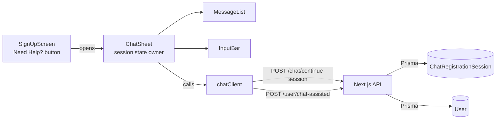

# TDD - Onboarding Chat Mobile Client

| Field        | Value                                                                                  |
| ------------ | -------------------------------------------------------------------------------------- |
| Tech Lead    | @asf0                                                                                  |
| Team         | asf0                                                                                   |
| Epic/Ticket  | [SCRUM-140](https://csai420.atlassian.net/browse/SCRUM-140) — EPIC 12                   |
| Related ADR  | [ADR-001](../adr/001-mobile-client-colocated-in-api-repo.md)                            |
| Status       | Draft                                                                                  |
| Created      | 2026-08-02                                                                             |
| Last Updated | 2026-08-02                                                                             |

## Context

The `chat-assisted-registration` slice delivered a working conversational registration backend:
`POST /chat/continue-session` drives a database-backed step machine, and `POST /user/chat-assisted`
creates the account. Both are live and covered by the Week 5 suite (17/17 passing against
`https://cs420-api.asf0.dev`).

What does not exist is any client for them. EPIC 12 specifies a React Native chat UI, but the
project has no mobile application at all — the Expo projects in the workspace are unrelated course
challenges. This TDD covers the technical direction for building that client and wiring it to the
endpoints that already exist. No backend source changes.

**Domain**: identity / onboarding.

**Stakeholders**: prospective users who cannot complete the standard signup form (the accessibility
and low-literacy cases EPIC 12 exists to serve); the course grader, who assesses EPIC 12 delivery.

## Problem Statement & Motivation

### Problems We're Solving

- **A delivered backend has no consumer.** `/chat/continue-session` and `/user/chat-assisted` are
  reachable only from a test harness. The user-visible behavior EPIC 12 promises does not exist.
    - Impact: EPIC 12 is 0% delivered despite its dependencies being complete.
- **The signup form is the only registration path, and it is not accessible enough.** Users who
  cannot complete a dense form have no alternative.
    - Impact: registration drop-off for exactly the population the product targets.

### Why Now?

- The backend dependency (EPIC 14 / `chat-assisted-registration`) is delivered and stable.
- EPIC 12's first five tasks (SCRUM-90–94) are assigned and unblocked.

### Impact of NOT Solving

- **Users**: no conversational or screen-reader-friendly registration path.
- **Technical**: the chat backend accrues drift with no client exercising it in a real runtime.

## Scope

### ✅ In Scope (V1)

- An Expo application at `mobile/` (see ADR-001), with navigation, theming, and test harness.
- A "Need Help?" affordance on the signup screen that opens a chat surface.
- A modal / bottom-sheet chat container owning session state.
- An auto-scrolling transcript with distinct user and assistant bubbles.
- An input bar with per-step keyboard configuration and keyboard-avoiding layout.
- Screen-reader labeling and dynamic font scaling across the chat surface.
- A transport module wrapping `/chat/continue-session` and `/user/chat-assisted`.
- Client-side, per-step input validation (see Technical Solution — this is load-bearing, not polish).

### ❌ Out of Scope (V1)

- Any change to backend source, schema, or routes.
- Speech-to-text and audio playback (SCRUM-95).
- Typing-status animations (SCRUM-96) — V1 ships a plain disabled/pending state only.
- Session persistence across app termination (SCRUM-97).
- Post-chat feedback modal (SCRUM-98).
- Expo Web (see Risks — the API serves no CORS headers).
- EAS build/submit configuration and store distribution.

### 🔮 Future Considerations (V2+)

- Server-side redaction of credentials in the persisted transcript (see Security).
- Replacing the rule-based step machine with the real LangGraph flow in `src/lib/onboarding/`, which
  is currently a set of stub nodes wired to no route.
- Moving validation to a contract shared by client and server so the two cannot drift.

## Technical Solution

### Architecture Overview

A thin, stateful UI over a stateless transport. The chat container is the single owner of session
state; the transport module is the single place that knows URLs and status codes; everything below
is presentational.

**Key Components**:

- **`ChatSheet`**: owns `chatSessionId`, `currentStep`, the transcript, and the collected-field
  accumulator. The only component that calls the transport.
- **`MessageList`**: renders the transcript; auto-scrolls; masks the credential turn.
- **`InputBar`**: per-step keyboard configuration, submit affordance, keyboard-avoiding layout, and
  per-step validation before a turn is allowed to advance.
- **`chatClient`**: `continueSession()` and `registerChatAssisted()`; owns base URL resolution and
  maps HTTP status to typed outcomes.

**Architecture Diagram**:

### Data Flow

1. User taps **Need Help?** → client mints a `chatSessionId` (UUID) and opens `ChatSheet`.
2. `ChatSheet` sends an opening turn to `/chat/continue-session` to obtain the first prompt.
3. For each turn: `InputBar` validates the input against the current step, `ChatSheet` records it in
   the accumulator, then posts it and adopts the returned `nextStep`.
4. On reaching `completion`, `ChatSheet` posts the accumulated `userData` to `/user/chat-assisted`.
5. `201` dismisses the sheet with a confirmation; `400`/`408`/`409` are surfaced in-sheet.

### The step machine is a counter, not a parser

This is the central design constraint and the most likely source of defects.

`advanceChat()` (`src/app/chat/continue-session/route.ts`) returns the prompt for the *current* step
and advances to the next. It never reads the user's message, never extracts a field, and never
validates. It only appends both turns to `conversationContext`.

Two consequences follow, and both belong to the client:

**(a) The client owns the field mapping.** Which field a message fills is determined by the step the
session is in *when the message is sent*:

| Step when sending      | Message fills                    | Assistant replies with                     |
| ---------------------- | -------------------------------- | ------------------------------------------ |
| `initial_greeting`     | *(nothing — opener)*             | "I'd be happy to help! What's your name?"  |
| `name_provided`        | `name` → `firstName`/`lastName`  | "Great! What's your email address?"        |
| `email_collection`     | `email`                          | "Thanks! What is your phone number?"       |
| `phone_collection`     | `phone`                          | "Perfect. What's your date of birth?"      |
| `birth_date_collection`| `birthDate`                      | "Almost done! Please choose a password."   |
| `password_collection`  | `password`                       | "Ready to finish? Let me create your account." |
| `completion`           | —                                | "Your registration is complete!"           |

Because `message` is required (`min(1)`), the first prompt cannot be obtained without sending
something; tapping **Need Help?** sends a synthetic opener.

**(b) The client is the only validator.** The server accepts any string at every step, so invalid
input is not caught until `/user/chat-assisted` rejects the whole payload with
`400 {errors[], requiresChat: true}` — after the user has answered all six questions. V1 therefore
validates per step against the same rules as `ChatAssistedRegistrationSchema`
(`src/lib/schemas/chat-assisted-registration.schema.ts`) and refuses to advance on failure.

One asymmetry needs explicit handling: the chat asks for a single "name", but `/user/chat-assisted`
requires both `firstName` and `lastName` non-empty after trim. A one-word answer produces an empty
`lastName` and a `400`.

### APIs & Endpoints

Consumed as-is. Note neither path carries an `/api` prefix.

| Endpoint                 | Method | Request                                                        | Response                                                         |
| ------------------------ | ------ | -------------------------------------------------------------- | ---------------------------------------------------------------- |
| `/chat/continue-session` | POST   | `{chatSessionId, message, context?}`                            | `200 {response, conversationContext[], nextStep, sessionActive}` · `400 {errors[]}` · `500` |
| `/user/chat-assisted`    | POST   | `{userData{email,password,birthDate,phone?,firstName,lastName}, chatSessionId, conversationLog?, lastActivity?, locale?, accessibilityMode?}` | `201 {user, message}` · `400 {errors[], requiresChat}` · `408 {message}` · `409 {error}` · `500` |

`conversationContext` entries are `{role, message}` — not `{role, content}`, which is the shape used
by the unrelated mock LangGraph endpoints.

`lastActivity` is optional and drives a 30-minute inactivity check evaluated *before* validation. The
client sends the timestamp of its last successful `continue-session` response so a genuinely stale
session yields `408` rather than silently succeeding.

### Database Changes

None. The client writes only through the two endpoints above, which persist to the existing
`ChatRegistrationSession` and `User` models.

## Risks

| Risk                                                        | Impact | Probability | Mitigation                                                                 |
| ----------------------------------------------------------- | ------ | ----------- | -------------------------------------------------------------------------- |
| Password persisted in plaintext in the transcript            | High   | Certain     | Mask in UI; document residual; V2 backend redaction slice (see Security)    |
| Client/server validation drift — client is the only gate     | High   | Medium      | Mirror `ChatAssistedRegistrationSchema` rule-for-rule; assert parity in tests |
| Adding `mobile/` breaks API typecheck / CI format gate       | High   | High        | Fences land in the first task; its gate re-runs the full root pipeline      |
| Step-offset semantics misimplemented                         | Medium | Medium      | Mapping table above is normative; unit tests assert the accumulator per step |
| One-word name → `400` at the final step                      | Medium | High        | Explicit handling in input validation                                       |
| 30-minute inactivity → `408` mid-flow                        | Medium | Medium      | Dedicated expired-session state with a restart affordance                   |
| No CORS/`OPTIONS` on the API → Expo Web unusable             | Low    | Certain     | Native-only for V1; documented constraint                                   |

## Implementation Plan

Slice-scoped; the task breakdown lives in `.specs/features/onboarding-chat-ui/tasks.md`.

| Phase                    | Task                                   | Jira      |
| ------------------------ | -------------------------------------- | --------- |
| **Phase 1 — Foundation** | Expo scaffold, transport, toolchain fences | *(new issue)* |
| **Phase 2 — Surface**    | Need Help? button                      | SCRUM-90  |
| **Phase 2 — Surface**    | Modal / bottom-sheet container         | SCRUM-91  |
| **Phase 3 — Transcript** | Auto-scrolling message list            | SCRUM-92  |
| **Phase 3 — Transcript** | Input bar, submit, keyboard avoidance  | SCRUM-93  |
| **Phase 4 — A11y**       | Screen-reader labels, dynamic font scaling | SCRUM-94 |

**Dependencies**: `chat-assisted-registration` slice (delivered); a reachable API host.

---

## Security Considerations

_Included because this flow handles credentials._

### Authentication & Authorization

Both endpoints are intentionally public — they create accounts and therefore run pre-authentication.
No `Authorization` header is sent or required. No token is issued by `/user/chat-assisted`; the user
signs in through the existing flow afterward.

### Data Protection

- **In transit**: TLS via the deployed host. Local development over plain HTTP on a LAN address is
  acceptable for development only and must never be pointed at production data.
- **At rest**: passwords are bcrypt-hashed (cost 10) by `/user/chat-assisted` before persistence.
- **Secrets**: the client holds none. The API base URL is configuration, not a secret.

### Known defect — credentials in the persisted transcript

At `password_collection` the user types their password as an ordinary chat message.
`updateChatSession()` writes it verbatim into `ChatRegistrationSession.conversationContext` as
`{role: 'user', message: '<plaintext password>'}`. `stripHtml()` sanitizes markup; it does not
redact.

The client mitigates the *visible* surface by rendering that turn masked and by never including the
credential turn in the `conversationLog` it sends to `/user/chat-assisted`. It cannot mitigate the
storage: the plaintext still transits to `/chat/continue-session` and is written to the database.

This is a backend defect and is **out of scope for this slice** — fixing it means changing a
delivered route covered by the Week 5 suite. It must be raised as a follow-up slice: redact at
`password_collection` before persisting, and consider backfilling existing rows.

### Security Best Practices

- Validate every field client-side before it leaves the device, and again server-side (already done).
- Do not log message contents in the client.
- Do not persist the accumulator to device storage in V1 (SCRUM-97 must address credential handling
  explicitly when it lands).

## Testing Strategy

| Test Type   | Scope                                   | Approach                                   |
| ----------- | --------------------------------------- | ------------------------------------------ |
| Unit        | `chatClient`, session id, validation rules | Jest + `jest-expo`, `fetch` stubbed        |
| Component   | Each UI component's behavior            | `@testing-library/react-native` 13          |
| Manual      | Device walkthrough, VoiceOver/TalkBack, max font size | Physical device or simulator     |

Tests ship inside the task that changes the behavior, per `.specs/codebase/CONVENTIONS.md`.

**Critical Scenarios**:

- Happy path: Need Help? → six turns → `201` → account exists in the database.
- Duplicate email: `409` surfaced without destroying the session; the user retries the email.
- Expired session: `408` produces a restart affordance, not a dead sheet.
- Invalid input at each step blocks advance and shows an inline error.
- Screen reader announces each assistant reply; layout survives maximum OS font size.

## Rollback Plan

The mobile client is unreleased and has no store distribution in V1, so rollback is `git revert` of
the slice branch. The only changes outside `mobile/` are additive toolchain exclusions and a CI job;
reverting them restores the current pipeline exactly. No migrations, no backend changes, no feature
flag required.

## Open Questions

| #   | Question                                                                | Owner | Status  |
| --- | ----------------------------------------------------------------------- | ----- | ------- |
| 1   | Follow-up slice to redact credentials in the persisted transcript — when? | @asf0 | 🔴 Open |
| 2   | Should SCRUM-99 be closed as superseded, given tests ship per-task?      | @asf0 | 🔴 Open |
