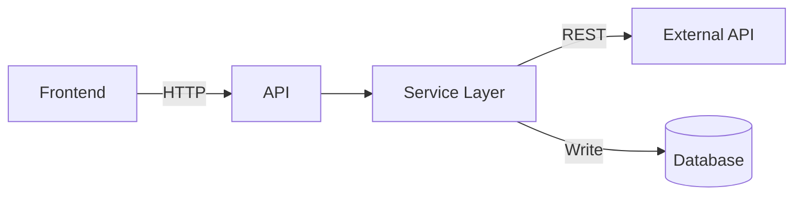

# TDD Template

Use this template to document **how** to build something after the direction is decided. Focus on
architecture, contracts, and plans — not implementation code.

|                     |                                                                                                       |
| ------------------- | ----------------------------------------------------------------------------------------------------- |
| **When to use**     | New feature, integration, migration, or cross-cutting technical work needing team alignment           |
| **When not to use** | The decision itself is still open — use [`rfc-template.md`](rfc-template.md) first                    |
| **Skill**           | `technical-design-doc-creator`                                                                        |
| **Save to**         | `docs/engineering/tdd/YYYY-MM-short-kebab-title.md`                                                   |
| **Review**          | Architect reviews technical direction; Tech Lead approves before implementation slices start          |
| **Scope hint**      | Delete optional sections for small projects (< 1 week); keep Security + Rollback for auth/payment/PII |

Document **decisions and contracts** (APIs, schemas, data flow, rollback strategy). Avoid CLI
commands, file paths, and framework-specific implementation code — those belong in the repo.

---

# TDD - [Project/Feature Name]

| Field           | Value                        |
| --------------- | ---------------------------- |
| Tech Lead       | @Name                        |
| Product Manager | @Name (if applicable)        |
| Team            | Name1, Name2                 |
| Epic/Ticket     | [Link to GitHub issue]       |
| Figma/Design    | [Link if applicable]         |
| Related RFC     | [Link to RFC if applicable]  |
| Related ADR     | [Link to ADR if applicable]  |
| Status          | Draft / In Review / Approved |
| Created         | YYYY-MM-DD                   |
| Last Updated    | YYYY-MM-DD                   |

## Context

[2–4 paragraphs. What is the current state? What business domain does this belong to? Who are the
stakeholders?]

**Background**: [Current system or feature this relates to.]

**Domain**: [e.g., billing, identity, scheduling]

**Stakeholders**: [Users, business, compliance, partner teams]

## Problem Statement & Motivation

### Problems We're Solving

- **Problem 1**: [Specific pain point]
    - Impact: [quantify if possible — time, cost, user friction]
- **Problem 2**: [Another pain point]
    - Impact: [quantify if possible]

### Why Now?

- [Business driver]
- [Technical driver]
- [User driver]

### Impact of NOT Solving

- **Business**: [revenue, competitive disadvantage]
- **Technical**: [debt, degradation]
- **Users**: [poor experience, churn risk]

## Scope

### ✅ In Scope (V1)

- [Capability or deliverable 1]
- [Capability or deliverable 2]
- [Integration point or migration step]
- [Data model or API surface]

### ❌ Out of Scope (V1)

- [Deferred capability — target V2 if known]
- [Integration not needed for MVP]
- [Advanced analytics, multi-region, etc.]

### 🔮 Future Considerations (V2+)

- [Feature A — after V1 validation]
- [Feature B — demand dependent]

## Technical Solution

### Architecture Overview

[High-level description of the solution and main components.]

**Key Components**:

- **[Component A]**: [responsibility]
- **[Component B]**: [responsibility]
- **[Component C]**: [responsibility]

**Architecture Diagram**:



### Data Flow

1. [User action → Frontend]
2. [Frontend → API — method and path]
3. [API → Service layer]
4. [Service → External API / Database]
5. [Response → Frontend]

### APIs & Endpoints

| Endpoint               | Method | Description      | Request     | Response         |
| ---------------------- | ------ | ---------------- | ----------- | ---------------- |
| `/api/v1/resource`     | POST   | Creates resource | `CreateDto` | `ResourceDto`    |
| `/api/v1/resource/:id` | GET    | Get by ID        | —           | `ResourceDto`    |
| `/api/v1/resource/:id` | DELETE | Delete resource  | —           | `204 No Content` |

**Example Request/Response**:

```json
// POST /api/v1/resource
{
  "name": "Example",
  "type": "standard"
}

// Response 201 Created
{
  "id": "550e8400-e29b-41d4-a716-446655440000",
  "name": "Example",
  "type": "standard",
  "status": "active",
  "createdAt": "2026-01-01T00:00:00Z"
}
```

### Database Changes

**New Tables**:

- **`TableName`** — [description]
    - Primary fields: id, tenantId, …
    - Timestamps: createdAt, updatedAt
    - Indexes: [columns for query performance]

**Schema Changes** (if modifying existing):

- Add column `fieldName` to `ExistingTable` — [type, constraints]

**Migration Strategy**:

- Test on staging first; run during low-traffic window; keep rollback migration ready

**Data Backfill** (if needed):

- Affected records: [estimate]
- Validation: [how to verify integrity after backfill]

## Risks

| Risk                     | Impact | Probability | Mitigation                               |
| ------------------------ | ------ | ----------- | ---------------------------------------- |
| [External API downtime]  | High   | Medium      | Circuit breaker, cache, degraded mode    |
| [Data migration failure] | High   | Low         | Staging dry-run, snapshot before migrate |
| [Performance regression] | Medium | Medium      | Load test, monitor latency               |
| [Security vulnerability] | High   | Low         | Security review, follow OWASP            |
| [Scope creep]            | Medium | High        | Strict scope, change-request process     |

## Implementation Plan

| Phase                | Task            | Description                     | Owner | Status | Estimate |
| -------------------- | --------------- | ------------------------------- | ----- | ------ | -------- |
| **Phase 1 — Setup**  | Credentials/env | API keys, staging config        | @Name | TODO   | 1d       |
| **Phase 2 — Core**   | Services & data | Business logic, persistence     | @Name | TODO   | Xd       |
| **Phase 3 — APIs**   | Endpoints       | Routes, validation, integration | @Name | TODO   | Xd       |
| **Phase 4 — Test**   | Unit + E2E      | Critical paths                  | @Team | TODO   | Xd       |
| **Phase 5 — Deploy** | Staging → prod  | Phased rollout                  | @Name | TODO   | Xd       |

**Total Estimate**: [X days / weeks]

**Dependencies**: [External API access, security review, other teams]

---

## Critical Sections

Include the sections below for production systems. **Security** is mandatory for auth, payment, or
PHI.

## Security Considerations

_Mandatory for auth, payment, PII/PHI._

### Authentication & Authorization

- **Authentication**: [JWT, OAuth 2.0, session-based, …]
- **Authorization**: [RBAC, tenant scoping, resource ownership]

### Data Protection

- **At Rest**: AES-256 (database encryption)
- **In Transit**: TLS 1.3 for all API communication
- **Secrets**: Environment variables / secret manager — never in repo or logs

**PII/PHI Handling**:

- Collected: [fields — no PHI in logs, errors, or telemetry]
- Retention: [policy]
- Audit: [WHO, WHAT, WHEN, WHERE for sensitive reads/writes]

### Compliance

| Regulation | Requirement          | Implementation                 |
| ---------- | -------------------- | ------------------------------ |
| HIPAA      | PHI isolation, audit | RLS, encryption, audit logging |
| GDPR/LGPD  | Deletion, consent    | [export/delete endpoints]      |
| PCI DSS    | No raw card data     | [tokenization via provider]    |

### Security Best Practices

- Input validation on all endpoints
- Parameterized queries; CSRF protection where applicable
- Rate limiting; audit logging for sensitive operations

## Testing Strategy

| Test Type   | Scope                | Coverage Target | Approach                |
| ----------- | -------------------- | --------------- | ----------------------- |
| Unit        | Services, pure logic | > 80%           | [test runner]           |
| Integration | API + database       | Critical paths  | [test DB, supertest]    |
| E2E         | User flows           | Happy + error   | Playwright              |
| Contract    | External API         | Key endpoints   | Mocks or contract tests |

**Critical Scenarios**:

- [Happy path — user completes primary flow]
- [Unauthorized / cross-tenant access denied]
- [External dependency failure — graceful degradation]

## Monitoring & Observability

_Mandatory for production._

| Metric                | Type    | Alert Threshold   | Dashboard |
| --------------------- | ------- | ----------------- | --------- |
| `api.latency`         | Latency | p95 > 1s for 5min | [tool]    |
| `api.error_rate`      | Error   | > 1% for 5min     | [tool]    |
| `external_api.errors` | Counter | > N in 1min       | [tool]    |

**Structured Logging**: JSON format; log requests, external calls, business events. **Never** log
secrets, full PAN, or PHI.

**Alerts**: [P1/P2 triggers and on-call actions]

## Rollback Plan

_Mandatory for production._

### Deployment Strategy

- Feature flag: `[FLAG_NAME]` (if applicable)
- Phased rollout: [5% → 25% → 50% → 100%] or canary

### Rollback Triggers

| Trigger                            | Action                       |
| ---------------------------------- | ---------------------------- |
| Error rate > 5% for 5 minutes      | Disable flag / revert deploy |
| External integration failing > 50% | Rollback to previous version |
| Migration failure                  | Stop — do not proceed        |

### Rollback Steps

1. Disable feature flag or revert deployment
2. Run down migration if schema changed; verify integrity
3. Notify engineering; create incident ticket if customer-facing
4. Post-mortem within 24h

---

## Optional Sections

Delete or expand based on project size.

## Success Metrics

| Metric            | Baseline | Target  | Measurement   |
| ----------------- | -------- | ------- | ------------- |
| API latency (p95) | N/A      | < 200ms | APM           |
| Error rate        | N/A      | < 0.1%  | Logs / Sentry |

## Alternatives Considered

| Option   | Pros   | Cons   | Why Not Chosen           |
| -------- | ------ | ------ | ------------------------ |
| Chosen   | [pros] | [cons] | ✅ Best fit for criteria |
| Option B | [pros] | [cons] | [reason]                 |

## Dependencies

| Dependency        | Type     | Owner  | Status | Risk |
| ----------------- | -------- | ------ | ------ | ---- |
| [External API]    | External | Vendor | Ready  | Low  |
| [Internal module] | Internal | @Team  | Ready  | Low  |

## Performance Requirements

| Metric       | Requirement | Measurement |
| ------------ | ----------- | ----------- |
| API p95      | < 500ms     | APM         |
| Availability | 99.9%       | Uptime      |

## Migration Plan

[If replacing an existing system — phases, data migration, backward compatibility, decommission
timeline.]

## Open Questions

| #   | Question        | Owner | Status  | Decision Date |
| --- | --------------- | ----- | ------- | ------------- |
| 1   | [Open question] | @Name | 🔴 Open | TBD           |

## Approval & Sign-off

| Role      | Name  | Status     | Date | Comments |
| --------- | ----- | ---------- | ---- | -------- |
| Tech Lead | @Name | ⏳ Pending | —    | —        |
| Architect | @Name | ⏳ Pending | —    | —        |
| Product   | @Name | ⏳ Pending | —    | —        |

**Next steps after approval**: Create slice backlog from PRD + TDD; pick first slice for
`.specs/features/` planning.
